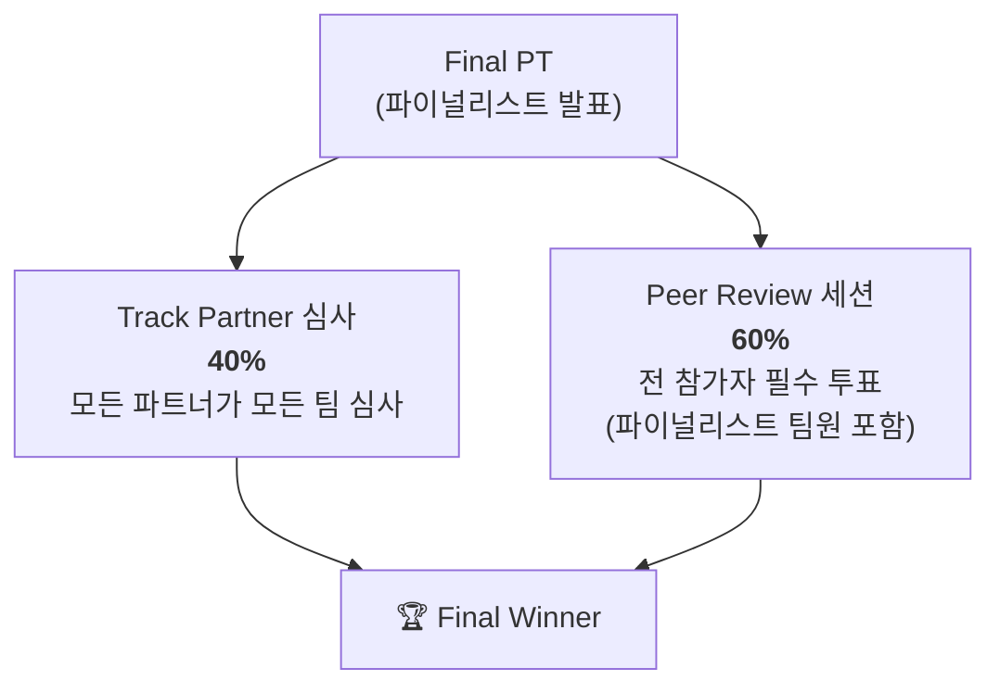

# 🏆 심사 방식 & 상금

## Final Winner 선정

- **Track Partner (40%) + Participant (60%)**
- Final PT 이후 Peer Review 세션 진행, **모든 참가자가 반드시 제출**해야 합니다.

## 상금

| 구분 | 상금 | 부상 |
| --- | --- | --- |
| 🥇 Final Winner | **KRW 3,000,000** | JUNCTION 2026 Golden Ticket + 항공권(1인 최대 150만원) + 경북도지사 표창 |
| 🏅 Track Winner | **KRW 2,000,000** | POSTECH 총장 표창 |
| 🥈 Track 2nd | **KRW 1,000,000** | POSTECH 연구산학처장 표창 |

> 📌 위 상금은 **대회 전체(Final/Track Winner)** 기준입니다. Lablup×FuriosaAI 트랙은 **자체 상금**을 별도 공지했습니다 — 1위 KRW 2,000,000 / 2위 KRW 1,000,000 + 굿즈(1인당 5만원). 자세한 내용은 [Lablup×Furiosa] 탭 참고.

> 💡 전략적 시사점: 참가자 투표가 60%이므로 **데모 엑스포에서 다른 참가자들이 "와" 하게 만드는 것**이 파트너 심사 대비 1.5배 가치가 있습니다. 시각화·라이브 데모에 투자할 것.
