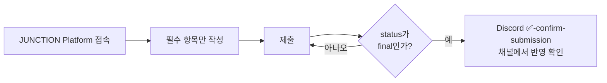

# 🚀 Kick-Off Mission

모든 팀은 **8/21 (금) 자정(24:00)까지** Mission 1 (Kickoff Mission)을 제출해야 합니다.

## 프로젝트 이름 형식 (필수)

- 프로젝트 이름은 **반드시 팀 번호로 시작**해야 합니다.
- 형식: `[Team Number] Project Name`
- 예시: `[01] Project Name` / `[63-1] Project Name`
- 팀 번호가 없는 제출물은 식별이 불가능할 수 있으며 **페널티 대상**이 될 수 있습니다.

## 제출 방법

- JUNCTION Platform을 통해 제출합니다.
- 모든 필드가 보이지만, **필수 항목만** 작성·제출하면 됩니다.
- 제출 후 status가 **"final"** 로 설정되었는지 반드시 확인하세요.
