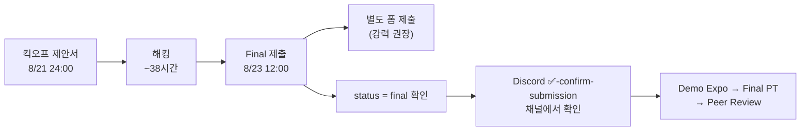
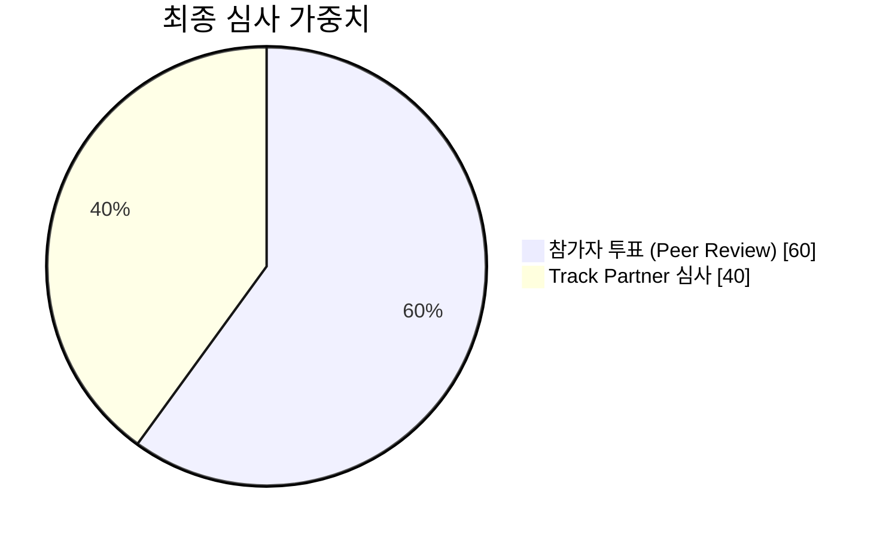

# 핵심 요약

> 현장 슬라이드·배포물·트랙 세션을 정리한 팀 내부 문서입니다. 새 정보가 생기면 탭별 마크다운에 계속 누적합니다.

## ⏰ 놓치면 끝나는 마감

| 항목 | 일시 | 비고 |
| --- | --- | --- |
| 🚀 Kick-off Mission | **8/21 (금) 24:00** | `[팀번호] 프로젝트명` 형식 필수 |
| 🏁 Final Mission | **8/23 (일) 12:00** | 지각 제출 절대 불가 |
| 🎬 Demo Expo | 8/23 13:00–16:00 | 라이브 데모 시나리오 준비 |
| 🎤 Final PT | 8/23 16:00–17:00 | |
| 🗳 Peer Review | 8/23 17:00–17:30 | **전원 필수 제출** |

## 제출 흐름

## 심사 구조 (Final Winner)

- 참가자 투표가 **60%** — 데모 엑스포와 파이널 PT에서 다른 참가자들에게 남기는 인상이 절반 이상을 결정합니다.
- 모든 Track Partner가 모든 파이널리스트를 심사합니다.

## 최종 제출물 4종

- [ ] **Pitch Deck (PDF, 영문)** — 전체 공개 Google Drive 링크
- [ ] **Project Summary** — 영문 또는 국문
- [ ] **Project Code** — GitHub 레포 링크 (오픈소스 사용 명시)
- [ ] **Project Name** — `[팀번호]` 접두 형식
