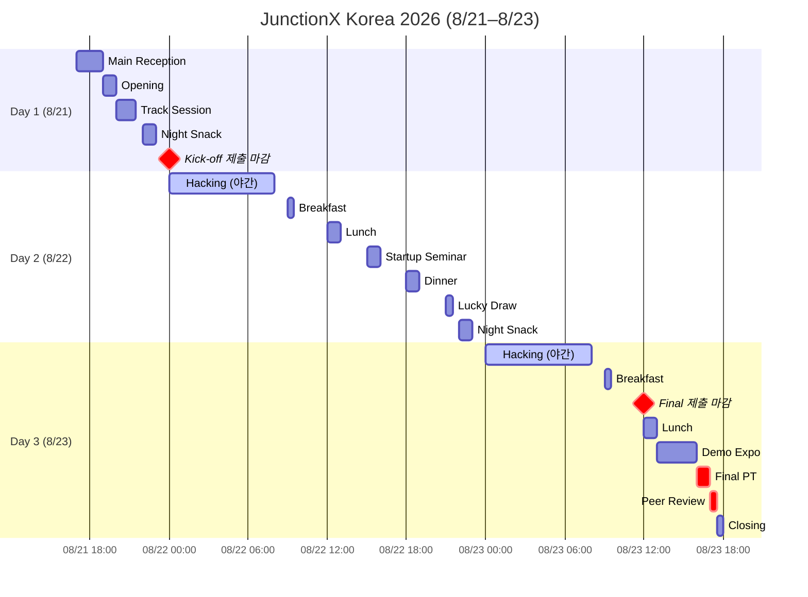

# 🗓 전체 타임라인

## August 21 (Day 1)

| 시간 | 일정 |
| --- | --- |
| 17:00 – 19:00 | Main Reception |
| 19:00 – 20:00 | Opening |
| 20:00 – 21:30 | Track Session |
| 22:00 | Night Snack |
| 24:00 | **Kick-off Mission Submission** |

## August 22 (Day 2)

| 시간 | 일정 | 출처 |
| --- | --- | --- |
| 00:00 – 08:00 | Hacking | 포스터 |
| 08:30 | Yoga Session | Day 2 슬라이드 |
| 09:00 – 09:30 | Breakfast | 포스터 |
| 12:00 | Lunch | 포스터 |
| 15:00 | Startup Seminar | 포스터 |
| (시작 미확인) – 17:00 | POPENS Tech Career Lab | Day 2 슬라이드 |
| 18:00 | Dinner | 포스터 |
| (시작 미확인) – 21:00 | Hacking | Day 2 슬라이드 |
| 21:00 – 21:30 | Lucky Draw | Day 2 슬라이드 |
| 22:00 | Night Snack | 포스터 |

> 📌 점심시간은 혼잡할 수 있으니 조금 이르거나 늦게 식사 권장 (공식 안내).

## August 23 (Day 3)

| 시간 | 일정 |
| --- | --- |
| 00:00 – 08:00 | Hacking |
| 09:00 – 09:30 | Breakfast |
| 12:00 | **Final Mission Submission** |
| 12:00 – 13:00 | Lunch |
| 13:00 – 16:00 | Demo Expo |
| 16:00 – 17:00 | Final PT |
| 17:00 – 17:30 | Peer Review |
| 17:30 – 18:00 | Closing |

> ⏳ 실제 개발 가용 시간: 8/21 21:30 (트랙 세션 종료) → 8/23 12:00 = **약 38.5시간** (식사·세미나 제외 시 실질 ~30시간)
