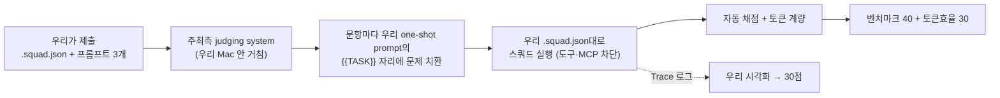

# 🛠 빌드 가이드 — 루브릭 정렬 단계별 실행

> 각 스텝마다 **무엇을 / 왜(어느 배점) / 완료 확인법**을 붙였습니다. 위에서부터 순서대로, 하나씩 이해하고 넘어가면 됩니다.

## 큰 그림: 평가가 실제로 어떻게 돌아가나



핵심 이해 3가지 (공식 확답 기준):
1. **스쿼드의 무기는 `.squad.json`에 적힌 것뿐** — 역할·시스템 프롬프트·모델 배정·(제한적) 도구 설정. 평가 중 MCP·외부 코드는 원천 차단.
2. **개발 단계에서는 무엇이든 허용** — Claude로 프롬프트를 다듬든, 자체 채점 루프를 돌리든 자유.
3. 시각화는 별도 코드 자유 — Trace 로그를 읽는 뷰어는 평가 바깥.

---

## STEP 1. Squad 로스터 설계 (AI:GO)

> 🟣 **v3.2 정정(8/22 16시)**: 아래 9종 로스터 설계는 **5종으로 축소 확정** — Conductor·Generic-Solver·Math-Solver·LCB-Coder·SWE-Patcher. 근거와 최종 프롬프트는 [프롬프트 초안] 탭. (계획 후 실행 모델이라 조건부 홉 불가 + 플래너가 매 문항 로스터를 읽어 미사용 에이전트도 비용)

**원칙 (v3.2)**: 에이전트 수 제한은 50이지만, AI:GO는 **계획 후 실행** 모델이라 조건부 홉이 없고 플래너가 매 문항 로스터 전체를 읽으며 홉마다 루프 공회전 리스크가 있다. 따라서 **directive가 배정할 전문가만 남긴 최소 로스터 + 문항당 1홉**이 기본형이고, 확장은 **계획 시점 라우팅**(과목 전문가) 또는 **정적 DAG 앙상블**(병렬 솔버 N + 판정자)로만 한다 — 둘 다 실측으로 이득이 증명될 때만. **원칙 0 (v3.4): 불필요한 에이전트 사용 금지** — 호출 1회 = 컨텍스트 전체 재전송(첫 완주 낭비의 91%). 에이전트는 답이 그것 없이는 나올 수 없을 때만 돈다.

| # | 에이전트 | 역할 | 모델 | 전담 |
| --- | --- | --- | --- | --- |
| 1 | **Conductor** | planner | **Qwen3-32B** (v3.5) | directive대로 태스크 1개 생성 — A/B 4/4 개수 1 (gpt-oss 플래너는 1~3 변동) |
| 2 | **Generic-Solver** | custom | gpt-oss | MMLU-Pro·GPQA 객관식 |
| 3 | **Math-Solver** | custom | gpt-oss | AIME/HMMT |
| 4 | **LCB-Coder** | custom | gpt-oss | 알고리즘 문제 (코드 블록) |
| 5 | **SWE-Patcher** | custom | gpt-oss | 저장소 패치 (128K 컨텍스트 직접 수용) |

확장 후보(실험 중): 인문·법 전문 Generic 솔버(law 40%·history 60% 약점), math 병렬 앙상블 + 판정자(AIME 난이도 대응). 프롬프트·세팅 최종본은 [프롬프트 초안] 탭.

**확인**: 워크스페이스 루트 `.squad.json` 생성 + 저장 시 갱신. 에이전트별 role 문자열에 planner 1개 포함.

## STEP 2. one-shot prompt 3개 작성

**무엇을**: coding/math/generic 각각, **published requests의 실제 요청 포맷**을 보고 작성.

```
[고정 prefix — 역할·규칙·출력 형식·좋은 예시 1개]
...
[맨 끝] {{TASK}}
```

- 각 프롬프트에 리터럴 `{{TASK}}` 필수, ≤32KB
- **REQUIRED OUTPUT 블록 형식을 그대로 따르라**는 지시를 프롬프트에 명시 (형식 미준수 = 자동 채점에서 무조건 오답)
- `{{TASK}}`를 맨 끝에 두는 이유: **prefix cache** — 고정부가 앞에 있어야 문항이 바뀌어도 캐시 적중 (실측으로 캐시 작동 확인됨)
- 트랙별 차이: math는 "\boxed{} 필수·간결한 풀이", generic은 "선택지 문자만", coding은 "코드 블록만"

**왜**: 벤치마크 40 (형식 준수가 정답의 전제) + 토큰효율 30 (캐시 할인).

**확인**: 제출 사이트 **Check without submitting** (무료·무제한) 통과.

## STEP 3. 로컬 리허설 (제출 비용 0)

**무엇을**:
1. `jxc-selfeval`로 연습 세트 채점 — dev key 사용 (제출 비용 계상 안 됨)
2. `/jxc-submit` 스킬로 `.squad.json`·프롬프트 3개 사전 검증 (1MiB·50에이전트·planner·{{TASK}}·32KB)

**⚠️ 대형 문항을 AI:GO 채팅창에 붙여넣지 말 것**: SWE-bench request.txt는 66KB라 GUI 입력창 글자수 제한에 걸림. GUI 채팅은 실평가 경로도 아님 — 리허설은 **API 호출(selfeval)** 또는 제출 사이트 Check/Test run으로.

**확인**: 트랙별 정확도·문항당 토큰이 베이스라인(단일 모델) 대비 개선됐는가. 개선 없으면 스쿼드 오버헤드만 낸 것.

## STEP 4. Test run → 1차 제출

**무엇을**: AI:GO Test run(1/5 과금)으로 실환경 확인 → **Submit to the queue** (대기 1·실행 1 제한).

**왜**: 리더보드에 상대 위치가 공개되므로 일찍 한 번 올려 기준점을 잡는다. 제출 실행은 전액 과금이므로 **1차 제출은 수렴 후 딱 1회**.

**확인**: Runs 탭에서 트랙별 점수 + 모델별 토큰. **capped 항목이 있는지 최우선 확인** (토큰 캡에 걸렸다는 뜻 — 해당 트랙 모델·프롬프트 재조정).

## STEP 5. 시각화 (30점 — 6축 1:1 대응)

**무엇을**: Run 상세·selfeval `results.jsonl`을 입력으로 받는 **정적 리플레이 뷰어** (로그 파일만으로 동작, 네트워크 불필요).

| 루브릭 축 | 구현 |
| --- | --- |
| Observability | 에이전트 노드 그래프 + 상태 배지 |
| Interpretability | 스텝별 입출력 한 줄 요약 |
| Traceability | 타임라인 스크러버 (클릭 → 그 시점 재현) |
| Explainability | 라우팅·확정(give-up) 결정의 근거 표시 |
| Clarity | 색·레이아웃 일관성, 과밀 금지 |
| **Insightfulness** | **누적 집계**: 유형별 토큰 낭비 지점, give-up이 아낀 토큰, 캐시 적중률 |

**왜**: 30점 + 데모 엑스포에서 참가자 투표(최종 심사 60%)를 움직이는 무기.

**확인**: 6축 각각에 대응 화면을 손가락으로 짚을 수 있는가.

## STEP 6. 보정 → 최종 제출 (8/23 오전)

**무엇을**: 리더보드·Run 상세 기반 마지막 조정 → 최종 Submission은 **8/23 오전 이른 시각** (실행 1개 제한 + 마감 큐 정체 위험, 사이트는 UTC 표시 주의) → 피치덱·리포 정리(오픈소스·attribution 명시) → 12:00 플랫폼 제출.

---

## 지금 어디까지 왔나

- [x] STEP 0 이해 완료 (평가 구조·제약 확정)
- [x] 사전 준비: 프로바이더 연결(8445/vLLM), 라우터 가동, dev key, 베이스라인 실행 중
- [x] STEP 1 Squad 생성 (8/22 13시) → v3.2 로스터 5종으로 재구성 중
- [x] STEP 2 one-shot 3종 v2(directive 포함) · Check 통과 · **1차 제출 실행 중**
- [x] STEP 3 리허설 도구: selfeval quick.sh(부트스트랩 CI) + analyze_run.py
- [x] STEP 5 시각화 뷰어 v1 완성 (bibimbap/viewer)
- [x] STEP 4 2차 제출 18:44 (v3.5) · **3차(최종) 제출 19:35 (v3.7b)**
- [ ] STEP 5 시각화 뷰어 v3 구현(설계 패널 완료, 구현 중) · STEP 6 피치덱·리포·플랫폼 제출(8/23 11:30)
