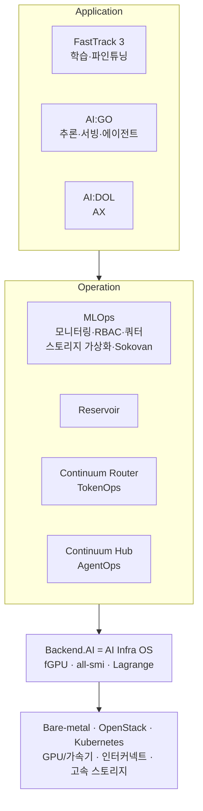
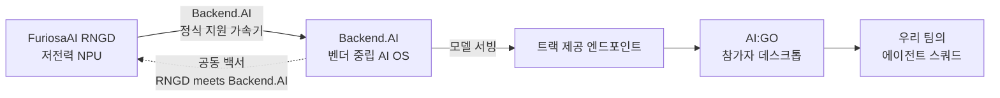

# 🏢 회사 리서치

> ✅ 공식 키노트(2026.08.21) 기재 사실 + 공개 자료 리서치를 병합했습니다. 키노트에 직접 나온 수치는 **[공식]** 으로 표시합니다.

## Lablup (래블업)

- **[공식]** 슬로건: **"Democratizing intelligence for humanity"** — 지능을 인류에게 민주화한다. 제품 미션은 **"Make AI Accessible / Scalable / Composable"**.
- **[공식]** 비전 문장: *"우리는 지능이 전기처럼 흘러, 필요한 곳 어디에나 닿는 세상을 향해 일합니다."* → **피치에 인용하기 좋은 문장**.
- **[공식]** 설립 **2015년 4월**, 임직원 **46명**.
- **[공식]** **한국 유일의 흑자 AI 인프라 소프트웨어 기업** (Korea's Only Profitable AI Infra-software Company).
- **[공식]** 거점: **서울(HQ) · 미국 산호세(US HQ) · EMEA · 싱가포르/APAC**.
- **[공식]** 오픈소스 후원: **Linux Foundation, CNCF, Python Software Foundation, PyTorch Foundation, Agentic AI Foundation** — 5개 재단 스폰서.
- 2026년 KOSDAQ 예비심사를 2개월 만에 통과 (2026년 일반기업 최단) — IPO 직전.

### [공식] 주요 고객사

| 분야 | 고객 |
| --- | --- |
| 대기업 | 삼성전자, LG전자, 현대모비스, CJ, 삼성웰스토리, Samsung Research, KT, 대한항공 |
| 금융·공공 | 한국은행, 신한은행, 심평원(HIRA), 경기도, 대한민국 해군, AICA |
| 의료 | 삼성서울병원, 충남대병원 |
| 연구·교육 | ETRI, KISTI, KIST, USC CARC, 성균관대, 국민대 |
| 방산·모빌리티 | LIG넥스원, 42dot, JTS |
| 클라우드 | KT Cloud, NHN Cloud |

## Backend.AI

- **[공식]** 정체성: **"모든 AI 가속기를 위한 벤더 중립 OS"** — 인프라를 가리지 않는 **AI OS**.
- **[공식]** 핵심 기능
  - **컨테이너 레벨 GPU 가상화** — GPU 하나를 여러 개의 가상 GPU로 분할 (fGPU)
  - RDMA 및 **NVIDIA Magnum IO GPUDirect Storage** 지원
  - **x86-64와 aarch64 모두** 지원
  - **에어갭·온프레미스·클라우드·하이브리드** 환경 운영
  - **Sokovan™ 오케스트레이터**로 멀티테넌시·멀티노드 워크로드 관리
- **[공식]** 검증된 이기종 가속기

| 벤더 | 지원 |
| --- | --- |
| NVIDIA | Blackwell(B300, B200), Grace Blackwell(GB300, GB200, GB10), Hopper(H200, H100), Ampere(A10, A40, A100), Turing(Titan RTX, RTX 8000, T4), Ada Lovelace(L40S, L4), Jetson(TX, Xavier, Orin, Thor) |
| AMD | Instinct MI250, MI300 |
| Intel | Gaudi 2, 3, Arc Pro |
| **국산 NPU** | **Furiosa (Warboy, RNGD)**, Rebellions (ATOM, ATOM+, Rebel) |
| 기타 | Groq, Graphcore, SambaNova, HyperAccel |

- **[공식]** 산업 배경: AI 연산 수요가 **연 약 4배**씩 증가. LLM 워크로드는 일반 HTTP 워크로드와 달리 느리고 불균일하며 비싸서, 입력 의존적 컨텍스트와 **노드 상태 인지 라우팅**이 필요 → 이것이 Continuum Router의 존재 이유.

### [공식] 제품 스택

## AI:GO — 이번 트랙의 주역

- **[공식]** 정식 명칭 **AI:GO Generative On-device**, 태그라인 **"Your Personal Agentic AI Platform"**. 로컬 PC·디바이스에서 도는 에이전틱 AI 플랫폼.
- **[공식]** 특징
  - **프라이버시 우선** — 로컬 추론 시 클라우드 연결 불필요, 모든 데이터가 사용자 PC 안에서 관리
  - **하드웨어 최적화 엔진** — macOS(Metal/MLX), Windows·Linux(CUDA/ROCm/oneAPI), CPU
  - **오픈소스로 공개**됨, AI:GO 안에서 **Hugging Face 모델 직접 검색·다운로드**
  - **OpenAI 호환 API** 제공 → 다른 AI 툴의 백엔드로 사용 가능 *(이전 추정이 아니라 확정 사실)*
  - **Mesh 네트워킹으로 여러 AI:GO 인스턴스 연결** — 고사양 PC에서 큰 모델을 돌리고 엣지 기기에서 접속
  - Backend.AI 클러스터의 기존 추론을 활용하거나 새 추론 세션을 시작
- **[공식]** UI 구성: Chat, Canvas, Translator, Creations, Agent Extensions, Automations, **Squad**, Memory, Statistics, Benchmark, Logs, API, Engines
- 설치: [go.backend.ai](https://go.backend.ai/) · macOS(Apple Silicon) 설치 파일 `https://bnd.ai/installer-stable-macos-aarch64`

## [공식] Continuum Suite (참고)

**Continuum Router** — 엔터프라이즈급 멀티 LLM 게이트웨이. OpenAI 호환이라 코드 변경 없이 통합, 자동 헬스체크·서킷 브레이커·모델 폴백, **5ms 미만 오버헤드**, 핫 리로드, Files API·모델 디스커버리·SSE 스트리밍, Admin REST API.

**Continuum Hub** — LLM 모니터링·정산 컨트롤 플레인. 요청 경로 바깥에서 동작하고 **본문 텍스트를 수집하지 않음**(토큰 수·비용 등 메타데이터만). 키·티어·예산 단위 조직 통제, 월 예산 도달 시 자동 차단, 크레딧·월별 인보이스까지 통합.

> 💡 이번 트랙의 토큰 계량·과금 방식이 Continuum Hub의 설계 철학(본문 미수집, 메타데이터 기반 계량)과 동일합니다. 피치에서 "우리 스쿼드는 Continuum Hub가 계량하는 방식 그대로 토큰 예산을 스스로 관리한다"는 식으로 엮으면 심사위원에게 잘 통합니다.

## FuriosaAI (퓨리오사AI)

- 2017년 백준호 창업. 2025년 **Meta의 8억 달러 인수 제안 거절**로 화제.
- 1세대 **WARBOY**(비전) → 2세대 **RNGD("Renegade")**

| 스펙 | 값 |
| --- | --- |
| 공정 | TSMC 5nm |
| 연산 | FP8 512 TFLOPS / 카드 |
| 메모리 | HBM3 48GB @ 1.5TB/s |
| TDP | **150–180W** (H100 대비 와트당 성능 약 3배 주장) |
| 처리량 | ~10B급 LLM 기준 2,000–3,000 tok/s |
| 아키텍처 | Tensor Contraction Processor |

- **[공식]** Backend.AI가 Warboy·RNGD를 정식 지원 가속기로 검증.
- LG EXAONE 프로덕션 배포(2026), NXT RNGD 서버 출시, Equinix 리스본 진출.
- **[공식]** 온보딩 세션 주제: *"Building the future of sustainable, programmable AI infrastructure"* — **지속가능성과 프로그래머빌리티**가 이 회사의 키워드.

> 💡 **전력 효율이 이 회사의 존재 이유**입니다. 채점에 토큰 효율 30점이 들어간 것은 우연이 아니며, 효율 서사를 피치에 엮으면 트랙 파트너 심사에 직접 꽂힙니다.

## 두 회사의 관계

## 출처

- **Lablup Track Challenge 공식 키노트 PDF** (JunctionX Korea 2026, 2026.08) — 29p
- [Lablup 공식](https://www.lablup.com/) · [Backend.AI](https://www.backend.ai) · [GitHub](https://github.com/lablup/backend.ai) · [Cloud](https://cloud.backend.ai)
- [RNGD 성능 백서](https://www.backend.ai/blog/2026-07-backend-ai-rngd-performance-whitepaper-release) · [이기종 GPU 운영 전략](https://www.backend.ai/blog/2026-06-heterogeneous-gpu-operation) · [PSF 스폰서십](https://www.backend.ai/blog/2026-02-lablup-PSF-Sponsorship)
- [KOSDAQ 최단 통과 (TechTimes)](https://www.techtimes.com/articles/322573/20260731/backendai-maker-lablup-wins-fastest-kosdaq-approval-2026-market-slips.htm)
- [RNGD 발표 (SiliconANGLE)](https://siliconangle.com/2024/08/26/startup-furiosaai-debuts-rngd-chip-llm-ai-multimodal-inference/) · [FuriosaAI 공식 블로그](https://furiosa.ai/blog/rngd-preview-furiosa-ai)
