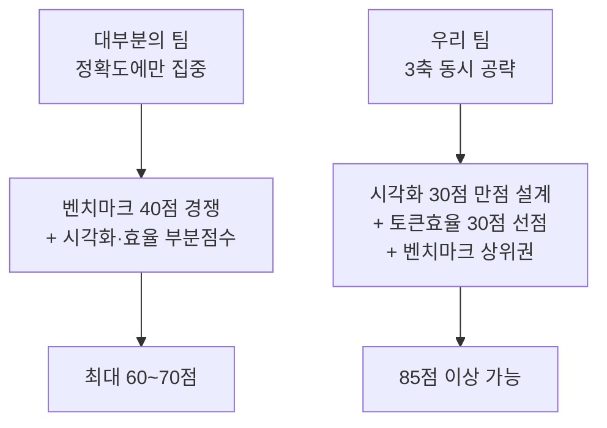

# 🏆 필승 전략

> ✅ 공식 배점 **벤치마크 40 / 시각화 30 / 토큰효율 30** 기준. 8/22 16시 정리: 실측으로 대체된 구 섹션(초기 모델 배정표·4역할 다이어그램·구 타임라인)은 제거했고, 현재 유효한 전략만 남김. 상세 근거는 [핵심 인사이트]·[프롬프트] 탭.

## 전략의 출발점

배점이 공개되면서 게임의 성격이 바뀌었습니다. **벤치마크는 40점뿐이고, 나머지 60점은 시각화와 토큰 효율**입니다. 정확도만 끌어올리는 팀은 최대 40점에서 멈춥니다. 반대로 시각화(30)와 토큰 효율(30)은 **엔지니어링 난이도가 낮으면서 배점이 크고, 경쟁 팀 대부분이 소홀히 할 영역**입니다.

---

## 1. 현재 전략 (v3, 8/22 오후) — 무캡·히든 난이도·플래너 중복 반영

세 가지 새 사실이 전략을 바꿉니다: **현재 캡 없음**(실격 리스크 소멸) · **히든은 AIME 2026/HMMT·GPQA**(단발 정답률 하락 확실) · **플래너 중복은 "프롬프트 튜닝 또는 모델 선택으로 극복 가능한 주제"**(운영진 공식 답변 = 러너도 같은 플로우, 우리가 풀어야 할 문제).

### 실험 1 — 플래너 루프 종료 (v3.2 프롬프트: create_task 1회 + PLAN READY) · 실패 시 플래너 모델 A/B

Conductor의 모델만 교체하고 같은 directive 요청을 보내 태스크 개수를 센다:

| 플래너 모델 | 가설 | 비고 |
| --- | --- | --- |
| gpt-oss-120b (현재) | 후보 계획을 여러 개 생성·병합하는 성향 → 3~5 중복 | 실측 5·5·2·5·3 |
| **Qwen3-32B** | 지시 순응형, 단일 태스크 기대 | 플래너는 문항당 1회 호출이라 속도 부담 적음 |
| K-EXAONE | 동일 가설, 느림 | Qwen 실패 시에만 |

플래너는 **모든 문항이 거치는 유일한 홉**이지만 호출은 1회뿐 — 여기서만 다른 모델을 써도 전체 토큰 영향은 작고, 중복이 사라지면 문항당 비용이 1/3~1/5로 떨어진다.

### 실험 2 — 중복을 앙상블로 전환 (실험 1 실패 시 플랜 B)

중복 태스크를 없앨 수 없다면 **다수결로 바꾼다**: directive에 "N개의 SOLVE 결과가 있으면 최종 답은 다수결(동률이면 첫 번째)로 확정"을 지시해 취합 단계가 self-consistency 투표가 되게 한다. 무캡 상태에서는 토큰 증가가 실격이 아니라 효율 점수(30) 손해로만 작용하므로, **히든 난이도(AIME 2026·GPQA)에서 다수결이 주는 정확도 이득(벤치마크 40, 순위제)** 이 더 클 수 있다. 판단 기준은 1차 제출의 트랙 가중치·점수 분포.

### 린 vs 앙상블 결정 프레임

| 구조 | 벤치마크 40 | 효율 30 | 적합 조건 |
| --- | --- | --- | --- |
| **린**(태스크 1개, 단발) | 단발 정답률에 의존 | 최상 | 캡이 생기거나, 효율 순위가 촘촘할 때 |
| **앙상블**(k표 다수결) | 어려운 세트에서 +5~15%p 기대 | k배 비용 | 무캡 + 정확도 격차가 순위를 가를 때 |
| **혼합** | math·GPQA만 앙상블, 쉬운 generic은 린 | 중간 | 트랙 가중치가 균등일 때 최적 |

→ **트랙 가중치가 균등**(⅓씩)으로 확인되면 혼합이 정답: 문항 수는 적지만 가중치가 같은 math에 표를 몰아주고, 문항 수가 많은 generic은 린으로 비용을 지킨다.

### 모델 다양성 원칙 (재확인)

- **솔버는 gpt-oss 단일 유지** — AIME·GPQA 공개 벤치에서도 3모델 중 최강이고, 약한 모델의 개입은 순손실(confgate 실증)
- **플래너·포맷 경비원 등 '판단 품질이 덜 중요한 홉'에만 타 모델 허용** — 실험 1의 결과에 따라 Conductor를 Qwen/EXAONE으로
- 앙상블을 쓸 때 이종 모델 투표(gpt-oss 2 + Qwen 1)는 오차 비상관 이득이 있으나, Qwen이 다수를 점하면 안 됨 — gpt-oss 과반 고정

## 2. 토큰 효율 30점 — 가장 확실한 득점 구간

### Prefix Cache 최적화 (주최측이 알려준 정답)

제출 대시보드가 **캐시된 입력은 저렴하게 과금되며, 변하는 부분 앞에 길고 안정적인 prefix를 두면 실질적 여유가 생긴다**고 명시했습니다. 이를 설계 원칙으로 삼습니다.

- 시스템 프롬프트·툴 정의·few-shot·역할 설명을 **전부 앞쪽에 고정**
- 문제 본문과 이전 시도 결과 등 가변부는 **반드시 맨 뒤**
- 스쿼드 전 에이전트가 **동일 prefix를 공유**하도록 통일 → 캐시 적중률 극대화
- Repair 단계에서 전체 히스토리 재전송 금지, **traceback 등 델타만** 전달
- 대시보드의 **Cached share(%)** 를 KPI로 두고 튜닝

### 과금 구조를 이용한 개발 루틴

| 단계 | 수단 | 비용 |
| --- | --- | --- |
| 프롬프트·스쿼드 튜닝 | Development keys | **제출에 계상 안 됨** |
| 파이프라인 점검 | Check | **완전 무료, 무제한** |
| 최종 평가 | Submission run | **전액 + 횟수만큼 누적** |

> ⚠️ **절대 하지 말 것**: "제출해서 점수 보고 고치기". 모든 제출 비용이 합산되므로 시행착오를 제출로 하면 30점이 증발합니다. Development key와 무료 Check에서 수렴시킨 뒤 제출하세요. 제출 슬롯은 대기 1·실행 1, 런 1회가 수 시간.

---

## 3. 시각화 30점 — 6개 축을 뷰 하나씩으로

공식 평가어 6개(observability, interpretability, traceability, explainability, clarity, insightfulness)에 **1:1로 대응하는 화면**을 만들면 채점자가 점수를 주지 않을 방법이 없습니다.

| 축 | 만들 것 |
| --- | --- |
| Observability | 에이전트 노드 그래프 + 실시간 상태 배지 |
| Interpretability | 스텝별 입력→출력 한 줄 요약 |
| Traceability | 타임라인 스크러버, 클릭 시 그 시점으로 되감기 |
| Explainability | 라우팅·포기 결정마다 근거 표시 |
| Clarity | 색상·레이아웃 일관성, 정보 과밀 배제 |
| **Insightfulness** | **여러 실행 누적 집계 뷰** ← 차별화 지점 |

**Insightfulness가 진짜 승부처입니다.** 대부분의 팀은 실행 애니메이션까지만 만들고 멈춥니다. 여러 실행을 누적해 "어떤 문제 유형에서 어떤 에이전트가 토큰을 낭비하는가", "포기 판단이 몇 토큰을 아꼈는가" 같은 집계를 보여주면 다른 팀과 완전히 분리됩니다.

입력은 **로그(텍스트) 형태의 Trace**이므로, 실행기와 시각화를 분리해 **로그 파일만 있으면 리플레이되는 구조**로 만드세요. 제출 이후에도 데모가 가능해지고, 데모 엑스포에서 네트워크 사고가 나도 안전합니다.

---

## 4. 피치 스토리라인

키노트의 출제 문장을 그대로 인용하며 시작하는 것이 가장 강력합니다.

1. **질문 인용** — "손에 쥘 수 있는 모델로 어디까지 갈 수 있는가?"
2. **우리의 답** — 거대 모델이 아니라 **구조**로 간다. 라우팅과 포기 판단이 있는 스쿼드.
3. **증명** — 벤치마크 순위 + Cached share·문제당 토큰 수치 + 누적 집계 시각화
4. **비전** — 저전력 NPU 위 소형 모델 스쿼드가 곧 **"Make AI Accessible"** 의 실현. Lablup의 미션 문장과 FuriosaAI의 전력 효율 서사를 그대로 잇는 마무리.

킬러 문장: **"우리는 X%의 정확도를 문제당 평균 Y 토큰으로 달성했고, 그 판단 과정 전부를 되감아 볼 수 있습니다."**

---

## 6. 규정 리스크

- **행사 전 작성 코드 금지** — 사전 설계한 agent-core는 아키텍처만 참고하고 코드는 현장에서 새로 작성. 재사용 판단 기준은 "행사 전에 공개된 오픈소스인가"이며, 애매하면 트랙 부스에 직접 확인.
- **AI:GO agent squad 기능이 핵심 경로에 있어야 함** — 자체 오케스트레이터로 전부 대체하면 실격 소지. AI:GO Squad를 중심에 두고 시각화·검증 도구를 바깥에 붙이는 구조로.
- 오픈소스 라이브러리 사용 시 리포에 **명시 필수**.
