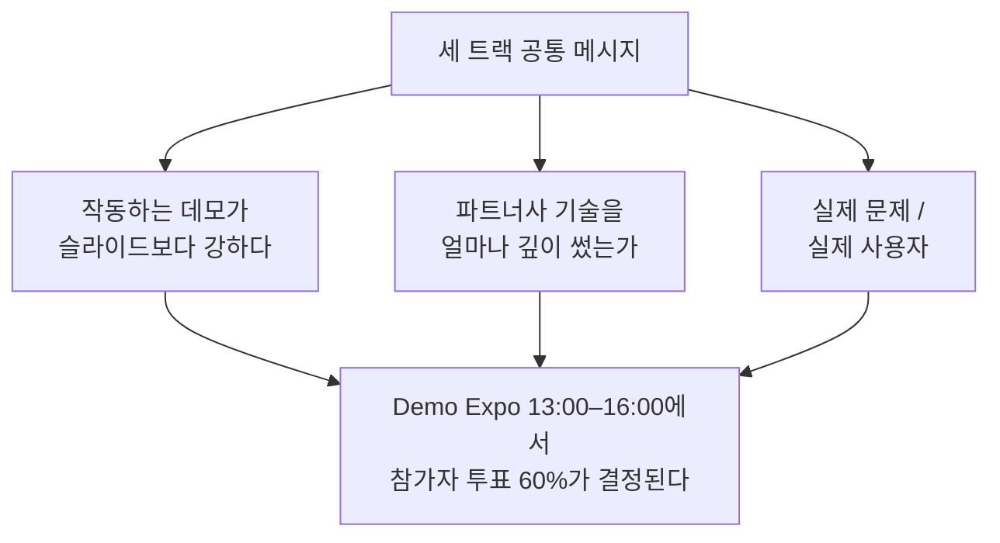

# 🧭 트랙 비교

현장에서 발표된 트랙들을 나란히 놓고 본 표입니다. 우리 팀은 **Lablup×FuriosaAI**를 선택했지만, **Peer Review(전체 심사의 60%)** 에서 다른 트랙 팀들을 평가하게 되므로 각 트랙이 무엇을 요구했는지 알아두면 판단 기준이 생깁니다.

| | Lablup × FuriosaAI | Microsoft × 경상북도 | Upstage |
| --- | --- | --- | --- |
| **핵심 과제** | 수학·코딩 문제를 푸는 AI 에이전트 스쿼드 | 공공데이터로 지역 문제 해결 | 서류 업무 자동화 |
| **필수 도구** | AI:GO + RNGD 서빙 모델 3종 | 공공데이터셋 최소 1개 | Upstage Studio |
| **핵심 채점축** | 벤치마크 정확도 + **토큰 효율** | **공공 가치 35%** > 기술 25% | **Studio 활용 깊이** + 창의성 + 사업성 |
| **강조된 가산점** | 인터랙티브 시각화 | 작동 프로토타입 (+10%) | 매끄럽게 도는 데모 |
| **오픈소스 의무** | 명시 없음 (대회 공통 규정 적용) | 인프라형은 **GitHub 공개 + 라이선스 명시 필수** | 명시 없음 |
| **성격** | 엔지니어링 최적화 승부 | 임팩트·공공성 승부 | 제품·시장 승부 |

## 세 트랙이 공유하는 것

세 연사 모두 같은 말을 다르게 했습니다. **껍데기 UI를 만들지 말 것**(Microsoft), **실제로 매끄럽게 돌아야 함**(Upstage), **에이전트 협업 과정을 눈에 보이게 할 것**(Lablup). 결국 데모 엑스포에서 3분 안에 "이게 진짜 돌아간다"를 보여주는 팀이 이깁니다.

## Peer Review 시 참고 기준

투표할 때 스스로에게 물어볼 것:

- 파트너사 기술이 **핵심 경로**에 있는가, 아니면 구색만 맞췄는가?
- 라이브로 새 입력을 넣었을 때도 동작하는가, 준비된 결과만 재생하는가?
- 해결한 문제가 **구체적인 누군가**의 것인가?
