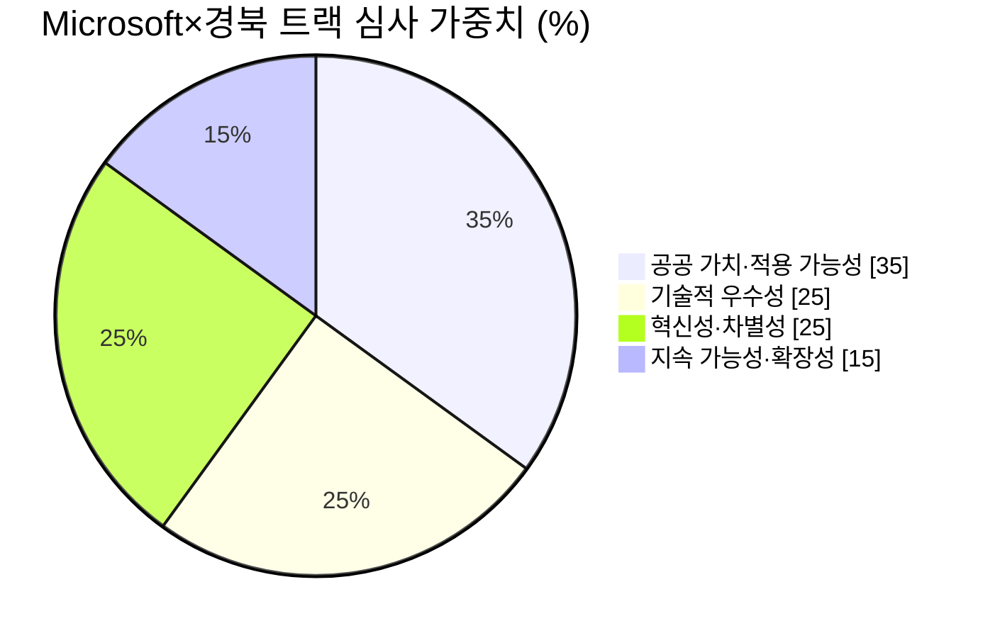

# 🛰 Microsoft × 경상북도 트랙 — 공공데이터

> 연사: Ryan (Microsoft Korea, AI 스페셜리스트) · Microsoft + 경상북도 + POSTECH 공동 트랙
> ⚠️ STT 손상 원문을 재구성한 번역·정리입니다. 세부 조건은 트랙 부스/Discord 기준.

## 미션 한 줄 요약

**공공데이터를 활용해 지역(경북)의 실제 문제를 해결하라.** 공공데이터셋 **최소 1개 사용 필수**. 접근법은 ① AI가 쓸 수 있는 데이터 인프라 구축(MCP 서버·코퍼스·플러그인 → GitHub 오픈소스 공개 필수) 또는 ② 지역 문제 해결 AI 서비스 개발.

## 트랜스크립트 재구성 번역

### 배경: 한국은 공공데이터 강국

> 한국은 이미 세계 최대급 공공데이터 보유국입니다. **10만 개 이상의 데이터셋**이 공공데이터포털(data.go.kr)에 공개되어 있고, **OECD 공공데이터 평가 4회 연속 1위**입니다. 데이터는 이미 준비되어 있고, 활용을 환영합니다. 진짜 과제는 **이 데이터를 AI가 효율적으로 쓸 수 있게 만드는 것**입니다.

### 사례 3가지

> **① 대한민국 법령 전체를 GitHub로** — 한국의 재능 있는 개인 개발자가 **개정 이력을 포함한 법령·규정 약 8만 건**을 마크다운으로 변환해 GitHub 저장소 하나에 마이그레이션했습니다. 덕분에 누구나 한국 법령을 오픈 코퍼스로 접근할 수 있게 되었고, 개발자들은 이걸로 에이전트를 만들거나 벡터 DB에 넣어 법률 검색을 훨씬 간결하게 만들고 있습니다.
>
> **② 법제처 데이터를 MCP 커넥터로** — 한국의 현직 공무원이 법령·개정 이력·판례를 **MCP 커넥터**로 만들었습니다. 법제처의 공공 법령 데이터를 온라인 MCP 서버로 노출해, 변호사·공무원들이 손쉽게 AI 에이전트를 만들어 쓰고 있습니다. 법조계·커뮤니티에 큰 영향을 준 프로젝트입니다.
>
> **③ 폭염 그늘막 지도** — 한 대학생 개발자가 건물·시설의 실시간 공공데이터를 크롤링해, **폭염 시 그늘쉼터를 찾아주는 지도**를 만들었습니다.
>
> 이 셋을 움직인 건 시스템도 예산도 국제적 지원도 아니었습니다. **한 사람의 마음이 먼저 움직인 것**이 이걸 가능하게 했습니다. 이제 여러분 차례입니다.

### 트랙 과제 정의

> 과제: **공공데이터를 사용해 지역(경북)의 실제 문제를 해결하라.** 타협 불가능한 조건 하나 — **공공데이터셋을 최소 1개 반드시 활용**해야 합니다.
>
> **접근법 A — 데이터 인프라 구축** (사례 ①② 유형): 경상북도 관련 공공데이터·행정 데이터를 **AI가 즉시 쓸 수 있는 형태**(MCP 서버, 코퍼스, 스킬, 플러그인 등 표준화된 방식)로 가공·공개.
> **접근법 B — 지역 문제 해결 서비스** (사례 ③ 유형): 공공데이터 + AI로 지역 문제를 발굴·분석하고, 이를 해결하는 AI 기반 서비스·솔루션 개발.
>
> 인프라를 선택하면 **오픈소스 라이선스를 명시해 GitHub에 공개**해야 합니다. 데이터 기반 위에 서비스까지 얹으면 더 큰 임팩트가 됩니다.

### 제출 조건

> 1. **공공데이터 필수** — 최소 1개 데이터셋 활용.
> 2. **Ready-to-run** — 비전문가도 바로 쓸 수 있을 만큼 간단하고 직관적이어야 함.
> 3. **오픈소스 기여** — 인프라형 프로젝트는 GitHub 공개 + 라이선스 명시. 경상북도가 **공식적으로 활용·적용할 수 있는** 결과물을 기대.
> 4. **프로토타입 보너스** — 챗봇, 웹 서비스, 모바일 앱 등 작동하는 결과물에 가산점.
>
> ❌ 피해야 할 것: 실제 데이터 통합 없는 껍데기 UI, 가공 없이 원본 데이터를 그대로 노출하는 것.

## 심사 기준

| 기준 | 배점 | 내용 |
| --- | --- | --- |
| 공공 가치·적용 가능성 | **35%** | 실제 공공 수요 해결, 측정 가능한 지역 임팩트 — **최대 배점** |
| 기술적 우수성 | 25% | 솔루션 품질, 기술 건전성, AI·공공데이터의 효과적 활용 |
| 혁신성·차별성 | 25% | 기존 접근 대비 독창성·창의성·고유성 |
| 지속 가능성·확장성 | 15% | 장기 운영 가능성, 유지보수성, 확장 잠재력 |
| 프로토타입 보너스 | **+10%** | 작동하는 데모(챗봇·웹앱·대시보드 등) 추가 가산 |

> 💡 기술(25%)보다 **공공 가치(35%)가 더 크다**고 연사가 명시적으로 강조 — "기술 자랑"이 아니라 "누구의 어떤 문제를 해결했나"가 승부처인 트랙.

## 마무리 멘트

> Microsoft의 미션은 "지구상의 모든 사람과 조직이 더 많은 것을 성취하도록 돕는 것"입니다. 이제 여러분이 공공을 도울 차례입니다. 언젠가 Microsoft보다 가치 있는 회사를 만들 창의적 혁신을 기대합니다.
