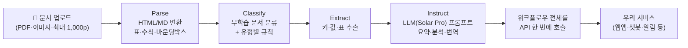

# 🛰 Upstage 트랙 — Document AI

> 연사: Ishan[추정] (Upstage 소프트웨어 엔지니어)
> ⚠️ STT 손상 원문을 재구성한 번역·정리입니다. 세부 조건은 트랙 부스/Discord 기준.

## 미션 한 줄 요약

**Upstage Studio로 서류 업무(paperwork)를 자동화하라.** 반복 실수·서류 업무의 고질적 병목을 하나 찾아 문서 자동화 서비스를 만들 것. **Studio가 문서 처리의 핵심 단계를 담당**해야 하며, 작동하는 데모가 필수.

## 트랜스크립트 재구성 번역

### 회사 소개

> 업스테이지는 한국·미국·일본에 거점을 둔 글로벌 AI 회사입니다. 비전은 "일을 위한 지능(intelligence for work)"[추정]을 만드는 것. 지금까지 **2억 7천만 달러를 투자받았고**, 잘 알려진 **포털 다음(Daum)을 인수**했습니다. 우리는 **한국 최초의 AGI/AI 유니콘**입니다.
>
> 아시는 분도 있겠지만, **이번 주 과기정통부가 소버린 AI(독자 파운데이션 모델) 발표**를 했고, 우리는 **SKT, LG와 함께 최종 3팀**에 선정됐습니다.
>
> 이 여정은 Solar 모델 공개에서 시작됐습니다[추정: 2023년 12월 Solar Mini]. 이후 파운데이션 모델을 **Solar Pro**로 확장해 왔고, 올해는 **에이전트**에 집중하고 있습니다. 그래서 만든 플랫폼이 **Upstage Studio**이고, 이번 해커톤에서 여러분이 쓰게 될 도구입니다.
>
> Solar Pro는 **아시아 유스케이스에 특화**되어 있습니다. 우리는 두 개의 파운데이션 모델 — **LLM(Solar)과 Document Parse** — 그리고 이 둘을 활용하는 플랫폼(Studio)을 갖고 있습니다. 가장 중요한 자산은 최고의 연구·교육 팀입니다.

### 문서 AI의 강자

> Solar는 많이 알지만, 우리가 **전통적으로 OCR 회사**였다는 건 잘 모릅니다. 2022년 첫 플랫폼 **Document AI/OCR**을 출시했고, AWS Marketplace에 문서 인텔리전스 모델을 올렸습니다(제가 직접 올렸습니다).
>
> 국내외 파트너·고객이 많습니다. 특히 **한화·하나[추정]** 가 기억에 남는데, **제품이 나오기도 전에 계약한 첫 고객**이었습니다. 그만큼 수요가 절실했다는 뜻입니다.
>
> 고객이 우리를 택하는 이유 두 가지 —
> **① 모델 성능**: 벤치마크만 좋은 모델이 많지만, 우리는 실전에서 좋습니다. 과기정통부 프로젝트에서 누가 이기는지 지켜봐 주세요.
> **② 확장성**: **하루 300만 페이지 이상**을 처리하고 있습니다. 예를 들어 **한국 의료 영수증의 80%가 매일 업스테이지를 거칩니다**. 수백 종의 문서 유형을 자동화해 왔습니다. 이 시장에서 이런 확장성을 가진 회사는 우리뿐이라고 생각합니다.

### Upstage Studio 기능

> Studio는 문서 워크플로우를 쉽게 만들게 해주는 플랫폼입니다. Parse·Classify·Extract·LLM 에이전트들이 있어서 가능합니다.
>
> **① Chat** — 문서를 업로드하면 채팅·검색·번역이 가능합니다. 계약서를 올리고 "총액이 얼마야?"라고 묻거나, 한국어 메뉴판을 중국어·프랑스어·영어로 번역할 수 있습니다.
>
> **② Automation(워크플로우)** — Parse, Classify, Extract, Instruct 노드를 조립해 자동화 파이프라인을 만듭니다:
> - **Parse**: 다양한 문서를 **HTML·마크다운으로 변환**. 수식, 차트, 표, 레이아웃, 다이어그램 처리. **바운딩 박스**로 출처 하이라이트 제공. 다중 페이지 표, 체크박스 등 지원. **파일당 1,000페이지 한도**, 속도 빠름.
> - **Classify**: **추가 학습 없이** 나만의 문서 클래스 정의. 문서를 올리면 클래스 자동 생성도 가능. 문서 유형별 규칙 부여 — 예: 항공화물운송장(airway bill)은 "총액이 $100 이하인지" 검증, 패킹리스트는 조건 위반 시 고객에게 자동 회신 메일.
> - **Extract**: 키-값, 리스트, **표를 높은 정확도로 추출**. 영수증이라면 총액·상호명·발행일 추출.
> - **Instruct**: 자연어 프롬프트로 맞춤 인사이트 생성 — 파싱된 문서에 LLM 프롬프트를 거는 노드.
>
> (라이브 데모 — 현장 네트워크 문제로 일부 생략) 콘솔에 튜토리얼이 있으니 따라 하시면 됩니다.

### 트랙 과제

> 과제: **Upstage Studio를 사용해 서류 업무를 자동화하라.**
> - 반복되는 실수, 서류 업무가 만드는 고질적 번거로움을 하나 찾아 **문서 자동화 서비스**를 만드세요.
> - Upstage Studio를 사용해야 하고, 다른 어떤 서비스와도 통합 가능.
> - **가장 중요한 것: Studio가 핵심 문서 처리 단계를 담당**해야 합니다.
> - 작동하는 결과물(deliverable)이어야 합니다.

### 심사·혜택

> - **Studio·API를 얼마나 깊이 활용했는가 — 30점 이상**[추정: 30%]. 완성도(실제로 매끄럽게 돌아가야 함), **창의성**도 언제나 중요합니다.
> - **비즈니스 플랜**: 구체적 시장·사용자·수익 구조를 찾을 것.
> - 혜택: 굿즈 패키지 + 제품 크레딧 [금액 원문 불명 — $50/$1,000 언급, 부스 확인 필요].
> - API 사용법: **Upstage Console 가입 → 행사 코드 입력 → 무료 크레딧 지급**. Studio 웹에서 워크플로우를 만들고 나면 **그대로 API로 호출**할 수 있습니다. 질문은 부스/Discord로.

## Studio 워크플로우 구조

## 회사 리서치 (검증된 사실)

| 항목 | 내용 |
| --- | --- |
| 소버린 AI | 2026.08.18 과기정통부 독자 AI 파운데이션 모델 **최종 3팀** 선정 (LG AI연구원·SKT·업스테이지). 업스테이지 강점: **100만 토큰 컨텍스트 + 국산 NPU 활용** |
| Daum 인수 | 2026.01 카카오와 MOU(주식 스왑) → **2026.05 인수 완료**. Solar + 다음 검색·30년치 한국어 콘텐츠로 AI 포털 전환 |
| Upstage Studio | **2026.04.01 정식 출시.** Parse→Classify→Extract→Instruct 노드 조립형, 코딩 없이 워크플로우 구성, 파일당 1,000페이지, API 연동 |
| 규모 | 하루 300만+ 페이지 처리, 의료 영수증 80% 처리 주장 |

## 시사점 (우리 팀 관점)

- 우리는 Lablup×Furiosa 트랙이므로 직접 경쟁은 아니지만, **Peer Review에서 이 트랙 팀들을 평가**하게 됩니다. 이 트랙의 강팀은 "Studio 깊은 활용 + 구체적 시장"을 보여줄 것.
- 소버린 AI 3팀 중 2팀(Upstage, 그리고 Lablup과 협업하는 FuriosaAI 진영)이 이 해커톤의 트랙 파트너 — "국산 AI 풀스택" 서사는 어느 트랙에서든 심사위원에게 통하는 코드입니다.

## 출처

- [소버린 AI 3팀 선정 (Korea Herald)](https://www.koreaherald.com/article/10844040) · [UPI](https://www.upi.com/amp/Top_News/World-News/2026/08/18/national-ai-model-contest-to-3-teams/3771787098293/) · [Korea Times](https://www.koreatimes.co.kr/amp/business/tech-science/20260818/lg-ai-research-sk-telecom-upstage-survive-next-cut-in-national-ai-model-project)
- [Daum 인수 완료 (Aju Press)](https://www.ajupress.com/view/20260507165500108) · [The Elec — 최종 계약](https://www.thelec.net/news/articleView.html?idxno=10235) · [Solar×Daum 통합 계획](https://www.thelec.net/news/articleView.html?idxno=11372)
- [Upstage Studio 출시 (DigitalToday)](https://www.digitaltoday.co.kr/en/view/44821/upstage-launches-ai-document-processing-platform-studio) · [제품 페이지](https://www.upstage.ai/products/studio) · [studio.upstage.ai](https://studio.upstage.ai/) · [1,000페이지 처리 (Asia Business Daily)](https://www.asiae.co.kr/en/article/2026040212591996276)
