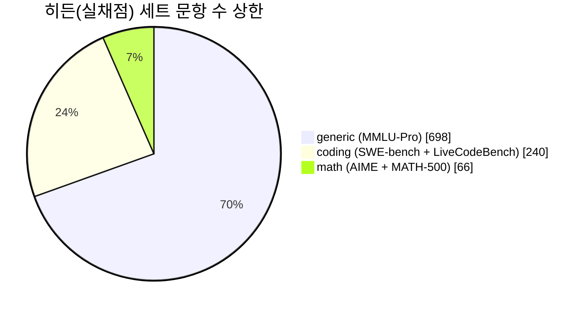
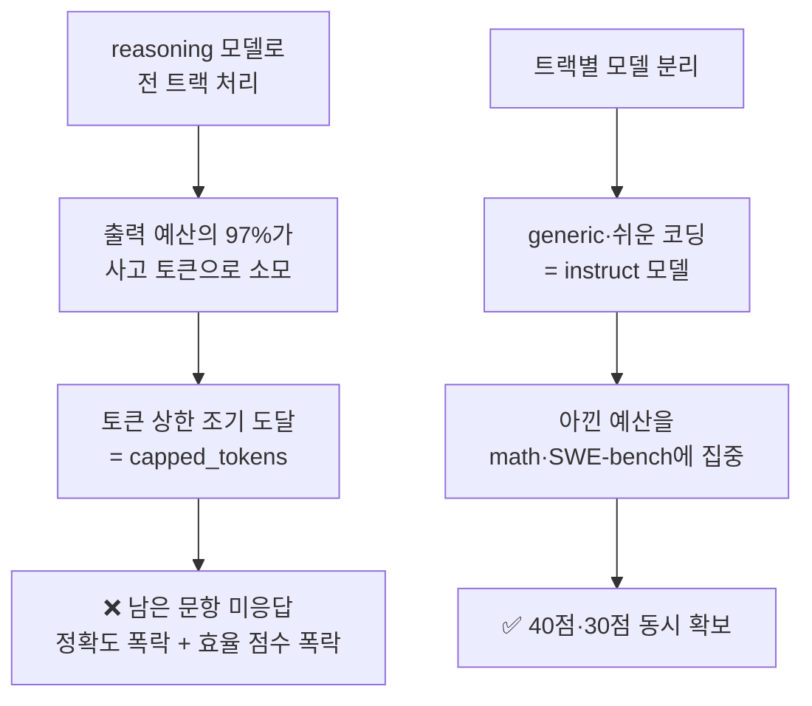

# 🔬 벤치마크 구성 & 모델 (실측)

> 출처: 제출 시스템의 **공개 엔드포인트** (`/practice-sets/*/manifest.json`, `/api/leaderboard`, `/openapi.json`). 로그인 없이 조회 가능한 참가자용 공개 정보이며, 2026-08-22 확인 기준입니다.

## ⚠️ 가장 중요한 발견 — 벤치마크는 3트랙이다

미션 설명의 "수학·코딩 등"이 막연한 표현이 아니었습니다. 채점은 **정확히 3개 트랙**으로 나뉩니다.

```
coding · math · generic
```

그리고 **히든 세트의 문항 수 분포가 전략을 완전히 뒤집습니다.**



| 트랙 | 히든 문항 수 | 공개(연습) 문항 수 | 구성 |
| --- | --- | --- | --- |
| **generic** | **448 ~ 698** | 140 | MMLU-Pro (카테고리당 20문항) |
| **coding** | 140 ~ 240 | 60 | SWE-bench-lite 150, LiveCodeBench-v6 40 |
| **math** | 60 ~ 66 | 164 | AIME 2024 30, MATH-500 level-5 134 |

> 🔥 **수학은 전체의 10% 미만입니다.** 대부분의 팀이 "고난도 수학 문제 풀이"에 스쿼드를 최적화하겠지만, 실제 점수의 대부분은 **MMLU-Pro 객관식 지식 문제**에서 나옵니다. 여기가 이번 트랙의 최대 정보 우위입니다.

## 채점 방식 (트랙별)

| 트랙 | 채점기 | 상세 |
| --- | --- | --- |
| math | `math_answer` | 정수형 답 → `integer_exact` + `math_verify` / 수식형 답 → `math_verify` |
| coding | `livecodebench_tests`, `swebench_docker` | **실제 테스트 실행**으로 채점 (Docker) |
| generic | (MMLU-Pro 객관식) | 정답 선택지 대조 |

- **math는 `run_repeats: 2`** — 문제를 2회 반복 실행해 **풀린 문제 전체에 대한 평균 정확도**로 집계합니다. 즉 운으로 한 번 맞히는 것이 통하지 않고, **재현성 있는 정답**이 필요합니다. 동시에 math는 토큰을 2배로 먹습니다.
- 공개 연습 세트는 `/practice-sets/`에서 직접 내려받을 수 있습니다 (`items.jsonl`, `visible-sets.zip`, `SHA256SUMS` 제공). **자체 채점 루프를 여기에 붙이면 제출 없이 무료로 성능을 측정**할 수 있습니다.

## 🚨 실행 캡 (Caps) — 공식 경고

리더보드 API가 반환하는 공지에 다음 내용이 명시되어 있습니다.

> 이 페이지의 모든 실행은 **항목별 wall-clock 상한**과 **실행별 토큰 상한** 아래에서 수행되었으며, 이는 모든 팀에게 동일합니다. 서로 다른 상한에서 실행된 결과는 직접 비교할 수 없고, 그 차이는 작은 보정 수준이 아닙니다. **평가 모델 3개 중 2개는 reasoning 모델**이며, 그중 하나는 **답을 내놓기 전 출력 예산의 97%를 reasoning 토큰에 소비**하는 것으로 측정되었습니다. 따라서 토큰 상한은 **reasoning 모델로 구성한 스쿼드에 instruct 모델 기반 스쿼드보다 대략 한 자릿수(약 10배) 더 가혹하게 작용**합니다.

API 스키마상 캡은 세 가지입니다: `per_run_token_cap`, `per_item_wallclock_seconds`, `infra_retries`.

### 이것이 의미하는 것



**평가 모델 구성: instruct 1개 + reasoning 2개.** 키노트 대시보드 화면에서 확인된 instruct 계열 모델은 **`Qwen3-30B-A3B-Instruct-2507-FP8`** 입니다. 나머지 2개 reasoning 모델의 정확한 ID는 팀 로그인 후 **Development keys / Development usage** 페이지 또는 dev key로 `/v1/models`를 호출하면 확인됩니다.

## ✅ 여기서 도출되는 모델 배정 전략

| 트랙 | 권장 모델 | 이유 |
| --- | --- | --- |
| **generic (MMLU-Pro)** | **instruct 모델** | 객관식 지식 문제. 장문 사고가 정확도를 거의 못 올리면서 토큰 상한만 태움. **문항 수가 가장 많아 여기서 캡에 걸리면 치명적** |
| **coding (LiveCodeBench)** | instruct + 테스트 실행 검증 | 실행 채점이므로 사고보다 **실제 테스트 통과**가 중요 |
| **coding (SWE-bench)** | reasoning (선별 투입) | 저장소 맥락 파악이 필요한 난이도 |
| **math (AIME/MATH-500 L5)** | **reasoning 모델** | 여기서만 사고 토큰이 값어치를 함. 단 `run_repeats: 2`로 비용 2배 |

> 💡 **핵심 통찰**: "어떤 모델이 더 똑똑한가"가 아니라 **"어느 트랙에 사고 예산을 쓸 것인가"** 가 이번 트랙의 진짜 문제입니다. 문항 수가 가장 많은 generic에 reasoning 모델을 붙이는 순간 토큰 상한에 걸려 무너집니다.

## 데이터셋 출처 표기

제출물에 아래 출처를 명시하는 것이 안전합니다 (매니페스트가 제공하는 attribution).

- **SWE-bench** — Jimenez et al., ICLR 2024
- **LiveCodeBench** — Jain et al., 2024 (LeetCode / AtCoder / CodeForces 문제 기반)
- **MATH-500** — Hendrycks et al., level-5 subset (MIT)
- **AIME 2024** — Mathematical Association of America 자료
- **MMLU-Pro** — TIGER-Lab (MIT)

## 확인 방법 (직접 재현)

```bash
curl -sk https://submission.jxc.events.lablup.ai:8444/practice-sets/set.manifest.json
```

```bash
curl -sk https://submission.jxc.events.lablup.ai:8444/api/leaderboard
```
