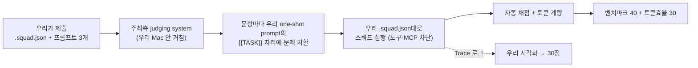

# 🛠 빌드 가이드 — 루브릭 정렬 단계별 실행

> 각 스텝마다 **무엇을 / 왜(어느 배점) / 완료 확인법**을 붙였습니다. 위에서부터 순서대로, 하나씩 이해하고 넘어가면 됩니다.

## 큰 그림: 평가가 실제로 어떻게 돌아가나



핵심 이해 3가지 (공식 확답 기준):
1. **스쿼드의 무기는 `.squad.json`에 적힌 것뿐** — 역할·시스템 프롬프트·모델 배정·(제한적) 도구 설정. 평가 중 MCP·외부 코드는 원천 차단.
2. **개발 단계에서는 무엇이든 허용** — Claude로 프롬프트를 다듬든, 자체 채점 루프를 돌리든 자유.
3. 시각화는 별도 코드 자유 — Trace 로그를 읽는 뷰어는 평가 바깥.

---

## STEP 1. Squad 뼈대 만들기 (AI:GO)

**무엇을**: AI:GO → Squad → 새 Squad → 워크스페이스 지정 → 에이전트 4개 구성.

| 에이전트 | 역할(role) | 모델 | 시스템 프롬프트의 일 |
| --- | --- | --- | --- |
| **Conductor** | **planner** (필수 키워드!) | gpt-oss-120b | 문제 유형·난이도 분류. 쉬우면 Fast에게 1-shot, 어려우면 Deep+Checker 가동. **계획은 최소 wave로** |
| **Fast Solver** | custom | gpt-oss-120b | generic·쉬운 문제 전담. "짧게, 형식대로만" |
| **Deep Solver** | custom | (베이스라인 승자: math는 reasoning 강한 모델) | math·어려운 코딩 전담 |
| **Checker** | reviewer | (경량 배정) | 형식 준수 확인 + 다른 경로 재검산. **불일치 시 1회만 재시도 요청, 그 뒤엔 최선안 확정** (= give-up 내장) |

**왜**: Planner 키워드는 제출 규칙 필수. 에이전트 수를 4개로 묶는 이유는 **에이전트가 늘수록 오케스트레이션 토큰이 곱으로 늘기 때문** (토큰효율 30점). give-up을 별도 에이전트가 아니라 Checker 규칙으로 넣는 것도 같은 이유.

**모델 배정 근거** (실측): SWE-bench 문항은 입력만 ~16.5K 토큰 → 컨텍스트가 입력+출력 합산이므로 Qwen3(40K)·EXAONE(48K)은 여유가 없고 **gpt-oss(128K)가 안전**. 쉬운 문제에서 gpt-oss가 48토큰/0.6초로 압도적 절약. 최종 배정은 베이스라인 매트릭스 완성 후 확정.

**확인**: 워크스페이스 루트에 `.squad.json` 생성됨 + Squad 저장할 때마다 갱신되는지 타임스탬프로 확인.

## STEP 2. one-shot prompt 3개 작성

**무엇을**: coding/math/generic 각각, **published requests의 실제 요청 포맷**을 보고 작성.

```
[고정 prefix — 역할·규칙·출력 형식·좋은 예시 1개]
...
[맨 끝] {{TASK}}
```

- 각 프롬프트에 리터럴 `{{TASK}}` 필수, ≤32KB
- **REQUIRED OUTPUT 블록 형식을 그대로 따르라**는 지시를 프롬프트에 명시 (형식 미준수 = 자동 채점에서 무조건 오답)
- `{{TASK}}`를 맨 끝에 두는 이유: **prefix cache** — 고정부가 앞에 있어야 문항이 바뀌어도 캐시 적중 (실측으로 캐시 작동 확인됨)
- 트랙별 차이: math는 "\boxed{} 필수·간결한 풀이", generic은 "선택지 문자만", coding은 "코드 블록만"

**왜**: 벤치마크 40 (형식 준수가 정답의 전제) + 토큰효율 30 (캐시 할인).

**확인**: 제출 사이트 **Check without submitting** (무료·무제한) 통과.

## STEP 3. 로컬 리허설 (제출 비용 0)

**무엇을**:
1. `jxc-selfeval`로 연습 세트 채점 — dev key 사용 (제출 비용 계상 안 됨)
2. `/jxc-submit` 스킬로 `.squad.json`·프롬프트 3개 사전 검증 (1MiB·50에이전트·planner·{{TASK}}·32KB)

**⚠️ 대형 문항을 AI:GO 채팅창에 붙여넣지 말 것**: SWE-bench request.txt는 66KB라 GUI 입력창 글자수 제한에 걸림. GUI 채팅은 실평가 경로도 아님 — 리허설은 **API 호출(selfeval)** 또는 제출 사이트 Check/Test run으로.

**확인**: 트랙별 정확도·문항당 토큰이 베이스라인(단일 모델) 대비 개선됐는가. 개선 없으면 스쿼드 오버헤드만 낸 것.

## STEP 4. Test run → 1차 제출

**무엇을**: AI:GO Test run(1/5 과금)으로 실환경 확인 → **Submit to the queue** (대기 1·실행 1 제한).

**왜**: 리더보드에 상대 위치가 공개되므로 일찍 한 번 올려 기준점을 잡는다. 제출 실행은 전액 과금이므로 **1차 제출은 수렴 후 딱 1회**.

**확인**: Runs 탭에서 트랙별 점수 + 모델별 토큰. **capped 항목이 있는지 최우선 확인** (토큰 캡에 걸렸다는 뜻 — 해당 트랙 모델·프롬프트 재조정).

## STEP 5. 시각화 (30점 — 6축 1:1 대응)

**무엇을**: Run 상세·selfeval `results.jsonl`을 입력으로 받는 **정적 리플레이 뷰어** (로그 파일만으로 동작, 네트워크 불필요).

| 루브릭 축 | 구현 |
| --- | --- |
| Observability | 에이전트 노드 그래프 + 상태 배지 |
| Interpretability | 스텝별 입출력 한 줄 요약 |
| Traceability | 타임라인 스크러버 (클릭 → 그 시점 재현) |
| Explainability | 라우팅·확정(give-up) 결정의 근거 표시 |
| Clarity | 색·레이아웃 일관성, 과밀 금지 |
| **Insightfulness** | **누적 집계**: 유형별 토큰 낭비 지점, give-up이 아낀 토큰, 캐시 적중률 |

**왜**: 30점 + 데모 엑스포에서 참가자 투표(최종 심사 60%)를 움직이는 무기.

**확인**: 6축 각각에 대응 화면을 손가락으로 짚을 수 있는가.

## STEP 6. 보정 → 최종 제출 (8/23 오전)

**무엇을**: 리더보드·Run 상세 기반 마지막 조정 → 최종 Submission은 **8/23 오전 이른 시각** (실행 1개 제한 + 마감 큐 정체 위험, 사이트는 UTC 표시 주의) → 피치덱·리포 정리(오픈소스·attribution 명시) → 12:00 플랫폼 제출.

---

## 지금 어디까지 왔나

- [x] STEP 0 이해 완료 (평가 구조·제약 확정)
- [x] 사전 준비: 프로바이더 연결(8445/vLLM), 라우터 가동, dev key, 베이스라인 실행 중
- [ ] STEP 1 Squad 뼈대 ← **다음 작업**
- [ ] STEP 2 프롬프트 3종 · STEP 3 리허설 · STEP 4 1차 제출 (8/22 저녁 목표)
- [ ] STEP 5 시각화 (병렬) · STEP 6 최종 제출
