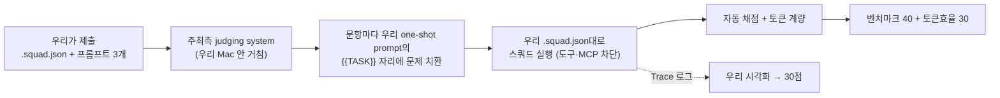

# 🛠 빌드 가이드 — 루브릭 정렬 단계별 실행

> 각 스텝마다 **무엇을 / 왜(어느 배점) / 완료 확인법**을 붙였습니다. 위에서부터 순서대로, 하나씩 이해하고 넘어가면 됩니다.

## 큰 그림: 평가가 실제로 어떻게 돌아가나



핵심 이해 3가지 (공식 확답 기준):
1. **스쿼드의 무기는 `.squad.json`에 적힌 것뿐** — 역할·시스템 프롬프트·모델 배정·(제한적) 도구 설정. 평가 중 MCP·외부 코드는 원천 차단.
2. **개발 단계에서는 무엇이든 허용** — Claude로 프롬프트를 다듬든, 자체 채점 루프를 돌리든 자유.
3. 시각화는 별도 코드 자유 — Trace 로그를 읽는 뷰어는 평가 바깥.

---

## STEP 1. Squad 로스터 설계 (AI:GO)

> 🟣 **v3.2 정정(8/22 16시)**: 아래 9종 로스터 설계는 **5종으로 축소 확정** — Conductor·Generic-Solver·Math-Solver·LCB-Coder·SWE-Patcher. 근거와 최종 프롬프트는 [프롬프트 초안] 탭. (계획 후 실행 모델이라 조건부 홉 불가 + 플래너가 매 문항 로스터를 읽어 미사용 에이전트도 비용)

**⚠️ 원칙 정정: 에이전트 개수는 제약이 아니다 (≤50이면 됨).** 토큰 비용을 결정하는 것은 로스터 크기가 아니라 **문항 하나가 실제로 거치는 홉(hop) 수**입니다. 등록만 되어 있고 호출되지 않는 스페셜리스트는 공짜입니다. 따라서 최적 구조는:

> **넓은 스페셜리스트 로스터 + 문항당 짧은 경로** — 트랙·문항 유형별 전담 에이전트를 여럿 두되, 각 문항은 그중 2~3홉만 지나가게 한다.

이게 벤치마크 점수에 유리한 이유: 범용 에이전트 하나가 모든 유형을 처리하면 시스템 프롬프트가 잡탕이 되어 형식 실수가 늘어납니다. **트랙별 전담 에이전트는 시스템 프롬프트를 그 유형의 출력 형식에 100% 특화**할 수 있고(벤치마크 40), 프롬프트가 짧아져 홉당 토큰도 줄어듭니다(효율 30).

**권장 로스터 (8~9개), AI:GO → Squad → 새 Squad → 에이전트 추가:**

| # | 에이전트 | 역할(role) | 모델(잠정) | 전담 |
| --- | --- | --- | --- | --- |
| 1 | **Conductor** | **planner** (필수) | gpt-oss | 트랙·유형 식별 → **단일 wave, 최소 계획**으로 해당 전담자에게 직행 |
| 2 | **Context-Handler** | custom | gpt-oss (128K) | **대형 입력 전담** — FuriosaAI 공식 권장 "긴 입력을 잘라 여러 번 받는 에이전트". SWE-bench(~16.5K tok)를 통째로 수용, 소형 컨텍스트 모델엔 요약본만 전달 |
| 3 | **Generic-Solver** | custom | gpt-oss | MMLU-Pro 전담. "선택지 문자만, 짧은 근거" 프로토콜 |
| ~~4~~ | ~~Generic-Adjudicator~~ | — | — | ❌ **confgate 실험으로 기각** (Qwen 2차 의견이 교정 4 < 가로챔 20, 전 θ 손해) |
| 5 | **Math-Solver** | custom | gpt-oss (math 100% 실측) | \boxed{} 프로토콜, 간결 풀이 |
| 6 | **Math-Verifier** | reviewer | Qwen3 | 독립 재풀이 → 불일치 시 1회 재시도 후 최선안 확정 (give-up 내장) |
| 7 | **LCB-Coder** | custom | gpt-oss | 알고리즘 문제: 코드 블록만 출력 |
| 8 | **SWE-Patcher** | custom | gpt-oss (128K) | 저장소 패치 형식 전담 |
| 9 | **Format-Warden** | custom | (최저 비용 모델) | **최종 출력이 REQUIRED OUTPUT 형식과 정확히 일치하는지** 마지막 관문 — 형식 오류 = 0점이므로 존재 가치 충분 |

문항당 실제 경로 예시: generic 확신 → `1→3` (2홉). generic 불확실 → `1→3→4` (3홉). math → `1→5→6` (3홉). SWE 대형 → `1→2→8→9` (4홉).

**EXAONE 배제(잠정)**: 실측 generic 50%/2,852tok + FuriosaAI 공식 "배치는 gpt-oss·Qwen 위주" — 정확도·토큰·속도 모두 열세. 매트릭스 완성 후 최종 확정.

**실험으로 결정할 것 (감이 아니라 Test run 데이터로)**:
- [x] ~~Adjudicator(2차 의견)가 generic 정확도를 올리는가~~ → **아니오, 기각** (confgate n=95)
- [ ] math self-consistency(2~3표 다수결)가 `run_repeats:2` 재현성에 도움 되는가
- [ ] Format-Warden 홉의 비용 대비 형식 오류 감소 효과
- [ ] 로스터 8~9개 vs 축소판 5개의 실측 점수·비용 비교

**확인**: 워크스페이스 루트 `.squad.json` 생성 + 저장 시 갱신. 에이전트별 role 문자열에 planner 1개 포함.

## STEP 2. one-shot prompt 3개 작성

**무엇을**: coding/math/generic 각각, **published requests의 실제 요청 포맷**을 보고 작성.

```
[고정 prefix — 역할·규칙·출력 형식·좋은 예시 1개]
...
[맨 끝] {{TASK}}
```

- 각 프롬프트에 리터럴 `{{TASK}}` 필수, ≤32KB
- **REQUIRED OUTPUT 블록 형식을 그대로 따르라**는 지시를 프롬프트에 명시 (형식 미준수 = 자동 채점에서 무조건 오답)
- `{{TASK}}`를 맨 끝에 두는 이유: **prefix cache** — 고정부가 앞에 있어야 문항이 바뀌어도 캐시 적중 (실측으로 캐시 작동 확인됨)
- 트랙별 차이: math는 "\boxed{} 필수·간결한 풀이", generic은 "선택지 문자만", coding은 "코드 블록만"

**왜**: 벤치마크 40 (형식 준수가 정답의 전제) + 토큰효율 30 (캐시 할인).

**확인**: 제출 사이트 **Check without submitting** (무료·무제한) 통과.

## STEP 3. 로컬 리허설 (제출 비용 0)

**무엇을**:
1. `jxc-selfeval`로 연습 세트 채점 — dev key 사용 (제출 비용 계상 안 됨)
2. `/jxc-submit` 스킬로 `.squad.json`·프롬프트 3개 사전 검증 (1MiB·50에이전트·planner·{{TASK}}·32KB)

**⚠️ 대형 문항을 AI:GO 채팅창에 붙여넣지 말 것**: SWE-bench request.txt는 66KB라 GUI 입력창 글자수 제한에 걸림. GUI 채팅은 실평가 경로도 아님 — 리허설은 **API 호출(selfeval)** 또는 제출 사이트 Check/Test run으로.

**확인**: 트랙별 정확도·문항당 토큰이 베이스라인(단일 모델) 대비 개선됐는가. 개선 없으면 스쿼드 오버헤드만 낸 것.

## STEP 4. Test run → 1차 제출

**무엇을**: AI:GO Test run(1/5 과금)으로 실환경 확인 → **Submit to the queue** (대기 1·실행 1 제한).

**왜**: 리더보드에 상대 위치가 공개되므로 일찍 한 번 올려 기준점을 잡는다. 제출 실행은 전액 과금이므로 **1차 제출은 수렴 후 딱 1회**.

**확인**: Runs 탭에서 트랙별 점수 + 모델별 토큰. **capped 항목이 있는지 최우선 확인** (토큰 캡에 걸렸다는 뜻 — 해당 트랙 모델·프롬프트 재조정).

## STEP 5. 시각화 (30점 — 6축 1:1 대응)

**무엇을**: Run 상세·selfeval `results.jsonl`을 입력으로 받는 **정적 리플레이 뷰어** (로그 파일만으로 동작, 네트워크 불필요).

| 루브릭 축 | 구현 |
| --- | --- |
| Observability | 에이전트 노드 그래프 + 상태 배지 |
| Interpretability | 스텝별 입출력 한 줄 요약 |
| Traceability | 타임라인 스크러버 (클릭 → 그 시점 재현) |
| Explainability | 라우팅·확정(give-up) 결정의 근거 표시 |
| Clarity | 색·레이아웃 일관성, 과밀 금지 |
| **Insightfulness** | **누적 집계**: 유형별 토큰 낭비 지점, give-up이 아낀 토큰, 캐시 적중률 |

**왜**: 30점 + 데모 엑스포에서 참가자 투표(최종 심사 60%)를 움직이는 무기.

**확인**: 6축 각각에 대응 화면을 손가락으로 짚을 수 있는가.

## STEP 6. 보정 → 최종 제출 (8/23 오전)

**무엇을**: 리더보드·Run 상세 기반 마지막 조정 → 최종 Submission은 **8/23 오전 이른 시각** (실행 1개 제한 + 마감 큐 정체 위험, 사이트는 UTC 표시 주의) → 피치덱·리포 정리(오픈소스·attribution 명시) → 12:00 플랫폼 제출.

---

## 지금 어디까지 왔나

- [x] STEP 0 이해 완료 (평가 구조·제약 확정)
- [x] 사전 준비: 프로바이더 연결(8445/vLLM), 라우터 가동, dev key, 베이스라인 실행 중
- [ ] STEP 1 Squad 뼈대 ← **다음 작업**
- [ ] STEP 2 프롬프트 3종 · STEP 3 리허설 · STEP 4 1차 제출 (8/22 저녁 목표)
- [ ] STEP 5 시각화 (병렬) · STEP 6 최종 제출
