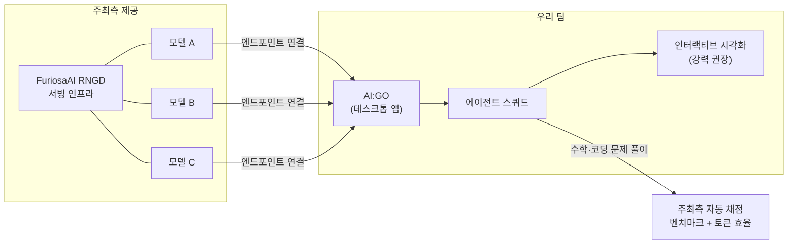

# 🎯 미션 분석

> **한 줄 요약**: Lablup **AI:GO**를 설치하고, **FuriosaAI RNGD**로 서빙되는 모델 3종을 연결해, **고난도 수학·코딩 문제를 푸는 AI 에이전트 스쿼드**를 만들어라.

## 전체 구조

## 요구사항 분해

| 구분 | 내용 | 확실도 |
| --- | --- | --- |
| 필수 | AI:GO 기반 멀티 에이전트(Squad) 시스템 구축 | 높음 |
| 필수 | FuriosaAI RNGD가 서빙하는 제공 모델 3종 사용 | 높음 |
| 필수 | 고난도 수학 + 코딩 문제 풀이 | 높음 |
| 필수 | 범용성 — **미공개 문제**가 채점에 쓰임 | 높음 |
| 필수 | 에이전트 구성을 주최측 플랫폼으로 제출, 자동 채점 | 중간 |
| 채점 | 벤치마크 점수 + **토큰 효율** | 높음 |
| 강력 권장 | 에이전트 협업 과정 인터랙티브 시각화 / 실시간 상태 추적 | 높음 |
| 허용 | 에이전트별 다른 모델·도구·프롬프트 조합 | 높음 |

## 채점의 함정 포인트

1. **오버피팅 금지 명시** — "somewhat general, we may provide challenging topics". 공개 벤치마크 하드코딩은 미공개 문제에서 무너집니다.
2. **토큰 효율이 별도 채점 항목** — 무한 다수결 샘플링·무제한 디베이트 루프는 감점 요인. 정확도 대비 토큰의 파레토 최적을 노릴 것.
3. **시각화가 사실상 준필수** — 순위 변별 요소. 참가자 투표 60%는 데모 인상으로 결정됩니다.
4. **RNGD 위 모델은 소형~중형** — 1카드 ~10B급 최적화(2,000–3,000 tok/s). **작은 모델의 약점을 멀티 에이전트 구조로 보완하는 것이 출제 의도**.

## 운영 정보

- 핸즈온 세션 **9:00–9:30** — AI:GO로 스쿼드 만드는 법 안내 *(밤 21시인지 아침 9시인지 원문 불명확 — 확인 필요)*
- 간식 제공(밤샘 대비), **우승팀 회사 투어** + 채용 연계 기회 언급
- AI:GO 설치: [go.backend.ai](https://go.backend.ai/) / macOS(Apple Silicon) 설치 파일: `https://bnd.ai/installer-stable-macos-aarch64`

## 트랙 부스 확인 리스트

- [ ] 핸즈온 시간 확정 (오늘 밤 21:00 vs 내일 09:00)
- [ ] 제공 모델 3종 이름·컨텍스트 길이·API 형식 (OpenAI 호환?)
- [ ] 에이전트 구성 "제출" 포맷 (설정 파일? 코드? AI:GO 프로젝트?)
- [ ] 채점 벤치마크 문제 유형·언어·부분 점수 여부
- [ ] 토큰 효율 산식 (총 토큰? 정답당 토큰? 가중치?)
- [ ] 외부 도구(코드 실행 샌드박스, 검색) 허용 범위
- [ ] AI:GO 외 자체 오케스트레이션 코드 허용 범위
