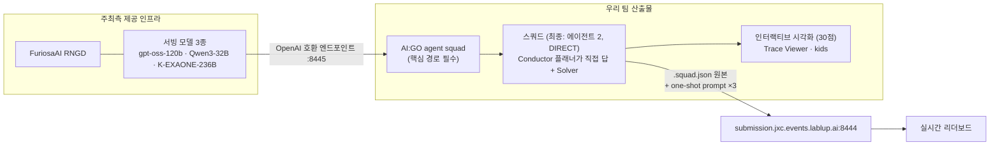

# 🎯 미션 분석 — Build the Ultimate Agent Squad

> ✅ **2026-08-21 공식 키노트 PDF(29p) 기준으로 전면 검증된 문서입니다.** 키노트 이전 STT 추정본의 오류(시각화 "권장" → 정식 30점, 온보딩 시각, 배점 미상 등)는 [📚 아카이브 › 트랜스크립트 번역] 머리말에 기록.

## 출제 배경 (공식)

> 오늘날 최고의 AI 모델들은 거대한 인프라 위에서 돌아갑니다. 최대 테크 기업들이 소유한 인프라 위에 구축된 API로 프론티어 모델 개발사가 제공하는 서비스에, 모두가 접근할 수 있는 것은 아닙니다. 그래서 Lablup과 FuriosaAI는 여러분에게 묻습니다:
>
> ### 🔥 "손에 쥘 수 있는 모델로 당신은 어디까지 갈 수 있는가?"
> *(How far can you go with a model you can actually hold in your hands?)*

이 한 문장이 트랙 전체의 심사 철학입니다. **거대 모델 없이, 손에 쥘 수 있는 크기의 모델로 얼마나 멀리 가는가.** 우리의 답: **"토큰이 어디로 가는지 보일 만큼 멀리"** — [핵심 인사이트]·[발표 재료].

## 제출 산출물 2종 (둘 다 필수)

| # | 산출물 | 설명 |
| --- | --- | --- |
| 1 | **문제 해결 AI 에이전트 스쿼드** | 여러 카테고리의 문제를 푸는 에이전트를 만들고 튜닝. **수학·코딩을 포함하되 이에 국한되지 않음** |
| 2 | **인터랙티브 시각화** | 스쿼드의 문제 해결 과정을 웹·애니메이션 제너레이터 등으로 시각화 |

> ⚠️ **시각화는 "권장"이 아니라 정식 산출물이며 100점 중 30점입니다.**

## 스쿼드 설계 요구사항 (공식 문구)

> 스쿼드는 **전적으로 여러분이 직접 설계**합니다 — 어떤 에이전트가 코드를 읽고, 어떤 에이전트가 수정하고, 어떤 에이전트가 결과를 검증하며, **어떤 에이전트가 "이제 포기할 때"임을 판단하는지**까지.
>
> **문제 해결 과정의 핵심 부분은 반드시 AI:GO의 agent squad 기능 위에 구축되어야 합니다.**

💡 출제자가 **"포기 판단 에이전트(give-up decider)"** 를 명시적으로 언급했습니다 — 토큰 효율 30점과 직결되는 설계 힌트. (우리 최종 설계에서는 별도 에이전트 대신 "에이전트 호출 1회 = 컨텍스트 재전송"이라는 원칙 0으로 내재화 — 실측상 확장 에이전트는 점수에 닿지 않음.)

## 전체 구조

## 제출 시스템 (팀 계정 확인 완료, 2026-08-22)

**🔗 https://submission.jxc.events.lablup.ai:8444**

- 제출물: 워크스페이스 루트의 **`.squad.json` 원본 통째로** (≤1MiB, 에이전트 ≤50, **"planner" 역할 1개 필수**) + 트랙별(coding/math/generic) **one-shot prompt** (각각 리터럴 `{{TASK}}` 필수, ≤32KB)
- **Check(검증)는 무료·무제한** — 큐 점유·쿨다운 없음. Submit도 같은 검증을 먼저 통과해야 큐 진입
- 큐 제약(실측): **대기 1개 · 실행 1개** (키노트의 "대기 3개"보다 타이트함 — 실계정 기준이 우선). 러너는 배치 처리라 결과 시점 예측 불가
- ⚠️ Squad Template JSON(Export)은 제출물이 아님 — **AI:GO에서 Squad를 실제 생성**해 워크스페이스에 만들어진 `.squad.json`을 제출
- 사이트 시간은 **UTC** 표시 (KST−9 주의)
- 탭 구성: Team home / Submit / Runs / Development keys / Development usage / Leaderboard
- **실시간 리더보드 공개**, Run 단위로 점수 + 모델별 토큰·요청 수 조회 가능 — 점수 = 트랙 정확도 가중 평균(coding .50 · math .25 · generic .25), 토큰·시간은 동점 처리, 캡 없음
- ✅ **dev key 발급 완료** — 사용법은 [AI:GO 가이드] 탭 (레이트리밋 60 rpm · 입력 120K / 출력 40K tpm)

## 온보딩 세션 (확정)

| 시간 | 주최 | 주제 |
| --- | --- | --- |
| **8/21 21:00 – 21:30** | Lablup | Let them do it: Building your own agent with AI:GO |
| **8/21 21:30 – 22:00** | FuriosaAI | Building the future of sustainable, programmable AI infrastructure |

## 트랙 상금 (대회 전체 상금과 별개)

| 순위 | 상금 | 부상 |
| --- | --- | --- |
| **#1** | KRW 2,000,000 | Lablup 굿즈 (1인당 5만원 상당) |
| **#2** | KRW 1,000,000 | Lablup 굿즈 (1인당 5만원 상당) |
| 수상팀 전체 | — | Lablup 회사 투어 + 커피챗/커리어챗 (희망자) |

대회 전체 상금(Final Winner 300만 · Track Winner 200만 · Track 2nd 100만)과 심사 구조(Track Partner 40% + Peer Review 60%)는 [📚 아카이브 › 심사·상금].
