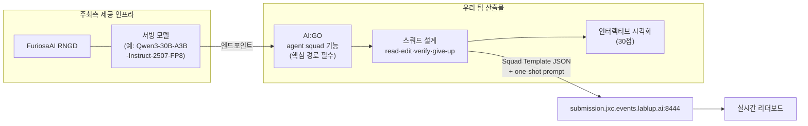

# 🎯 미션 분석 — Build the Ultimate Agent Squad

> ✅ **2026-08-21 공식 키노트 PDF(29p) 기준으로 전면 검증·정정된 문서입니다.** 이전 STT 기반 추정 중 틀린 부분은 아래 "정정 내역"에 정리했습니다.

## 출제 배경 (공식)

> 오늘날 최고의 AI 모델들은 거대한 인프라 위에서 돌아갑니다. 최대 테크 기업들이 소유한 인프라 위에 구축된 API로 프론티어 모델 개발사가 제공하는 서비스에, 모두가 접근할 수 있는 것은 아닙니다. 그래서 Lablup과 FuriosaAI는 여러분에게 묻습니다:
>
> ### 🔥 "손에 쥘 수 있는 모델로 당신은 어디까지 갈 수 있는가?"
> *(How far can you go with a model you can actually hold in your hands?)*

이 한 문장이 트랙 전체의 심사 철학입니다. **거대 모델 없이, 손에 쥘 수 있는 크기의 모델로 얼마나 멀리 가는가.**

## 제출 산출물 2종 (둘 다 필수)

| # | 산출물 | 설명 |
| --- | --- | --- |
| 1 | **문제 해결 AI 에이전트 스쿼드** | 여러 카테고리의 문제를 푸는 에이전트를 만들고 튜닝. **수학·코딩을 포함하되 이에 국한되지 않음** |
| 2 | **인터랙티브 시각화** | 스쿼드의 문제 해결 과정을 웹·애니메이션 제너레이터 등으로 시각화 |

> ⚠️ **시각화는 "권장"이 아니라 정식 산출물이며 100점 중 30점입니다.** (이전 문서에서 "강력 권장"으로 잘못 기재했었음)

## 스쿼드 설계 요구사항 (공식 문구)

> 스쿼드는 **전적으로 여러분이 직접 설계**합니다 — 어떤 에이전트가 코드를 읽고, 어떤 에이전트가 수정하고, 어떤 에이전트가 결과를 검증하며, **어떤 에이전트가 "이제 포기할 때"임을 판단하는지**까지.
>
> **문제 해결 과정의 핵심 부분은 반드시 AI:GO의 agent squad 기능 위에 구축되어야 합니다.**

💡 출제자가 **"포기 판단 에이전트(give-up decider)"** 를 명시적으로 언급했습니다. 이는 단순한 디테일이 아니라 **토큰 효율 30점과 직결되는 설계 힌트**입니다.

## 전체 구조

## 제출 시스템

**🔗 https://submission.jxc.events.lablup.ai:8444**

- 제출물: **Squad Template JSON** + 트랙별 **one-shot prompt**
- **Check(검증)는 무료이며 원하는 만큼 반복 가능** — Submit을 누르기 전까지 큐에 들어가지 않음
- 대기 제출 **최대 3개**, 동시 실행 **1개** (팀당 한 번에 하나의 평가만 실행, 나머지는 대기)
- 탭 구성: Team home / Submit / Runs / Development keys / Development usage / Leaderboard
- **실시간 리더보드 공개** — 전 참가팀의 벤치마크 결과가 공개 표시됨
- Run 단위 상세 조회 가능: 각 벤치마크 실행의 최종 점수 + 실행 중 모델별 사용 토큰 수

## 온보딩 세션 (확정)

| 시간 | 주최 | 주제 |
| --- | --- | --- |
| **21:00 – 21:30** | Lablup | Let them do it: Building your own agent with AI:GO |
| **21:30 – 22:00** | FuriosaAI | Building the future of sustainable, programmable AI infrastructure |

> ✅ 이전 문서의 "핸즈온 9:00–9:30 (시간 불명확)"은 **오류**였습니다. 실제로는 **8/21 밤 21:00부터 두 개 세션**입니다.

## 트랙 상금 (대회 전체 상금과 별개)

| 순위 | 상금 | 부상 |
| --- | --- | --- |
| **#1** | KRW 2,000,000 | Lablup 굿즈 (1인당 5만원 상당) |
| **#2** | KRW 1,000,000 | Lablup 굿즈 (1인당 5만원 상당) |
| 수상팀 전체 | — | Lablup 회사 투어 + 커피챗/커리어챗 (희망자) |

## 🔧 정정 내역 (이전 STT 기반 문서 대비)

| 항목 | 이전(추정) | 공식(확정) |
| --- | --- | --- |
| 시각화 | "강력 권장" | **정식 채점 30점** |
| 채점 배점 | "벤치마크 + 토큰 효율" | **벤치마크 40 / 시각화 30 / 토큰효율 30** |
| 온보딩 | "9:00–9:30, 시간 불명" | **21:00 Lablup + 21:30 Furiosa** |
| 토큰 효율 산식 | "미확인" | **USD/Mtok 기준, test run 1/5 · submission full** |
| 제출 방법 | "다운로드 후 복사·붙여넣기(추정)" | **Squad Template JSON을 제출 사이트에 입력** |
| 문제 범위 | "수학·코딩" | **수학·코딩 포함, 이에 국한되지 않음** |
| 트랙 상금 | 미확인 | **1위 200만 / 2위 100만 + 굿즈** |
| AI:GO API | "OpenAI 호환 가능성" | **OpenAI 호환 API 확정** |
