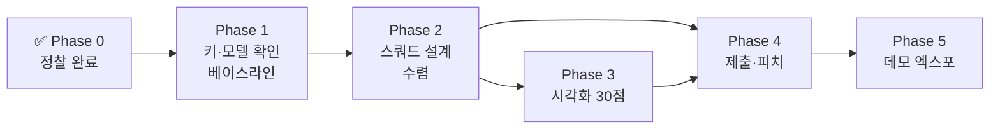
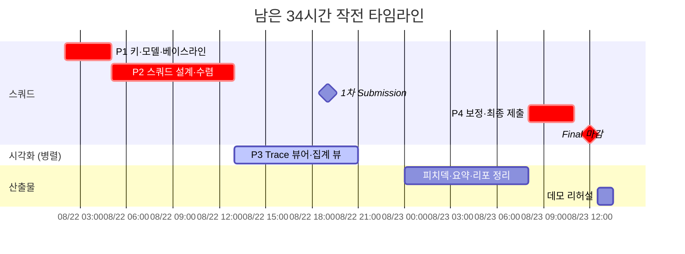

# 🧭 작전 플랜 (8/22 새벽 기준)

> 파이널 마감 **8/23 12:00**까지 약 34시간. 완료된 것과 남은 것을 단계별로 관리하는 실행 보드입니다. 진행되면 체크박스를 갱신해 계속 쌓습니다.

## 전체 흐름

시각화(P3)와 스쿼드 튜닝(P2 후반)은 **의존성이 없어 병렬 진행** 가능 — 팀원이 나뉘어 있다면 여기서 갈라집니다.

---

## ✅ Phase 0 — 정찰 (완료)

- [x] 공식 키노트 분석, 채점 배점 확정 (벤치마크 40 / 시각화 30 / 토큰효율 30)
- [x] 벤치마크 실측: 3트랙 구성, 히든 분포 (generic 448~698 / coding 140~240 / math 60~66)
- [x] 평가 모델 구성 파악: instruct 1 (Qwen3-30B-A3B) + reasoning 2 (ID 미확인)
- [x] 연습 세트 다운로드 + SHA256 검증 + **자체 채점 루프 완성** (`jxc-selfeval`, 채점기 3종 검증)
- [x] 공정성 점검: practice set은 의도된 공개 (사용 정당)
- [x] 결정적 제약 발견: **평가 중 스쿼드 도구 사용 불가** → LLM 기반 검증으로 전략 정정

## Phase 1 — 키·모델 확인 & 베이스라인 (지금 즉시, ~3h)

> 목표: **모델 3종의 실체를 숫자로 파악**한다. 이후 모든 결정의 입력값.

- [ ] 제출 사이트 팀 로그인 → **dev key 발급** (Development keys 탭)
- [ ] dev key로 `/v1/models` 호출 → **모델 3종 ID 확보** (특히 reasoning 2종)
- [ ] **published requests** 페이지에서 트랙별 실제 요청 포맷 + REQUIRED OUTput 블록 수집 → selfeval 프롬프트를 이 포맷으로 교체
- [ ] AI:GO 설치 확인 + Squad 기능 훑기 (Submit 페이지에서 **Squad Template JSON 스키마** 확보)
- [ ] **베이스라인 매트릭스**: 모델 3종 × 트랙 3종, `--limit 20`으로 selfeval 실행

측정 결과는 아래 표에 채웁니다 (문항당 출력 토큰 = 효율 지표):

| 모델 | generic 정확도/토큰 | math 정확도/토큰 | LCB 정확도/토큰 |
| --- | --- | --- | --- |
| (instruct) Qwen3-30B-A3B | ? | ? | ? |
| (reasoning A) ? | ? | ? | ? |
| (reasoning B) ? | ? | ? | ? |

**의사결정 게이트**: 이 표가 나오면 트랙별 모델 배정을 확정한다. 가설(generic=instruct, math=reasoning)이 숫자로 뒤집히면 숫자를 따른다.

## Phase 2 — 스쿼드 설계 & 수렴 (8/22 오전~오후, ~8h)

> 목표: Squad Template JSON + one-shot prompt를 **무료 Check와 dev key로 수렴**시킨다.

- [ ] 역할 프롬프트 작성: Router / Solver / **Verifier(경로 이중화·형식 검증, 도구 없음)** / Give-up Judge
- [ ] **prefix 구조 설계**: 고정부(역할·지시·예시) 앞, 가변부(문제) 뒤 → Cached share % 극대화
- [ ] REQUIRED OUTPUT 형식 준수를 Verifier의 1순위 점검 항목으로 (형식 미준수 = 무조건 오답)
- [ ] 트랙별 토큰 예산 정책: generic은 짧게 끊고, math만 사고 예산 허용, 캡 대비 안전 마진
- [ ] selfeval 전체 문항(연습 세트)으로 자가 채점 → 정확도·토큰 수렴 확인
- [ ] 무료 **Check** 반복 → **Test run(1/5 과금)** 으로 실환경 검증
- [ ] **1차 Submission** (8/22 저녁) → 리더보드에서 상대 위치 확인

## Phase 3 — 시각화 30점 (8/22 오후~밤, 병렬 ~6h)

> 목표: 6개 평가축(observability/interpretability/traceability/explainability/clarity/**insightfulness**)에 1:1 대응하는 뷰.

- [ ] Trace 로그 스키마 확정 — selfeval `results.jsonl` + run 상세를 입력으로
- [ ] **로그 파일만으로 리플레이되는** 정적 웹 뷰어 (실행기와 분리 → 데모 안전)
- [ ] 노드 그래프 + 상태 배지 + 타임라인 스크러버 + 결정 근거 표시
- [ ] **누적 집계 뷰**: 유형별 토큰 낭비 지점, give-up이 아낀 토큰 — 차별화 포인트
- [ ] 데모 30초 시나리오: "어려운 문제 투입 → 스쿼드 협업 → give-up/성공 분기"

## Phase 4 — 최종 제출 (8/23 00:00~12:00)

- [ ] 리더보드 기반 최종 보정 → **최종 Submission은 8/23 오전 일찍** (동시 실행 1개 제한, 마감 직전 큐 정체 위험)
- [ ] 피치덱 (영문 PDF) — 구성: 출제 질문 인용 → 구조로 답함 → 수치 증명 → Make AI Accessible 비전
- [ ] Google Drive 링크 **"링크 있는 모든 사용자" 공개** 확인 (시크릿 창 테스트)
- [ ] GitHub repo 정리: README, **오픈소스 명시**, practice set attribution 표기, 히든 세트 서술 금지
- [ ] Project Summary (영/국문) 작성
- [ ] **11:30까지 플랫폼 제출 + status `final` 확인 + Discord `✅-confirm-submission` 확인 + 별도 폼 제출**

## Phase 5 — 데모 엑스포 & PT (8/23 오후)

- [ ] 리플레이 데모 리허설 (네트워크 불필요 구조 확인)
- [ ] 참가자 투표 60% 공략: 부스 방문객용 30초 스토리 + 시각화 인터랙션 체험
- [ ] Final PT 진출 시: 발표 4분 구성 = 질문 인용(30s) → 아키텍처(60s) → 라이브 리플레이(90s) → 수치·비전(60s)

---

## ⏱ 타임박스 요약

## 리스크 보드

| 리스크 | 대응 |
| --- | --- |
| 마감 직전 제출 큐 정체 (동시 1개) | 최종 제출을 8/23 **오전 일찍**, 11:30을 자체 데드라인으로 |
| reasoning 모델이 토큰 캡 초과 | 베이스라인에서 문항당 토큰 측정 → 트랙별 예산 상한 하드코딩 |
| math `run_repeats: 2` 변동성 | 온도 낮추기·형식 고정으로 재현성 우선 |
| Squad Template 스키마 미지 | Phase 1에서 Submit 페이지 스키마 최우선 확보 |
| 시각화가 늦어짐 | P3는 스쿼드와 독립 — 로그 스키마만 먼저 합의하면 병렬 안전 |
