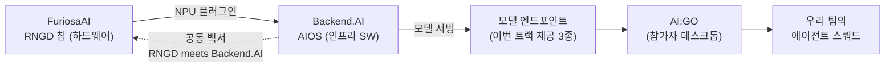

# 🏢 회사 리서치

## Lablup (래블업)

- 2015년 창업, 모토 **"Make AI Accessible"**. 서울 본사 + 미국 지사.
- 2026년 **KOSDAQ 예비심사를 2개월 만에 통과** (2026년 일반기업 최단 기록) — IPO 직전이라 이번 트랙에 공을 들일 시기.
- 오픈소스 DNA: Backend.AI 자체가 오픈소스, Python asyncio/aiohttp 기반. 2026년 2월 **Python Software Foundation 스폰서** 합류. 사내에 CPython/주요 오픈소스 커미터 다수.
- 고객: 삼성전자, LG전자, 신한은행, 한국은행, 해군, 삼성서울병원, USC 등 **120개+ 기관 프로덕션 사용**.
- 핵심 기술: CUDA API 호출을 소프트웨어로 가로채 **GPU를 소수점 단위로 분할(fractional GPU)**, 오버헤드 5% 미만. 이기종 가속기를 HAL로 통일 관리.

## Backend.AI

- 컨테이너 기반 AI 클러스터 플랫폼. **CUDA GPU, ROCm GPU, Intel Gaudi, Google TPU, Graphcore IPU, Tenstorrent, HyperAccel, FuriosaAI·Rebellions(국산 NPU)** 플러그인 지원.
- 2026.07 **"RNGD meets Backend.AI" 백서** — RNGD 실 LLM 워크로드 처리량·지연·전력 효율·멀티카드 확장성 벤치마크. **이번 트랙 인프라의 배경 문서, 팀 전원 필독.**
- 이기종 GPU/NPU 통합 모니터링 도구 **all-smi** 공개.

## AI:GO (Backend.AI:GO)

- 태그라인 **"Your AI, Your Machine, Your Rules"**. macOS/Windows/Linux **무료** 데스크톱 앱.
- 로컬 GPU/NPU 모델 실행 + 클라우드 엔드포인트 연결.
- **Cowork**(단일 에이전트 자율 작업), **Squad**(계획–실행–리뷰 분담 멀티 에이전트) — **이번 미션은 사실상 Squad 쇼케이스**.
- 신제품이라 문서·커뮤니티 자료가 적음 → **핸즈온 세션 참석이 결정적**.

## FuriosaAI (퓨리오사AI)

- 2017년 백준호(전 삼성·AMD) 창업, 한국 대표 NPU 스타트업. 2025년 **Meta의 8억 달러 인수 제안 거절**로 유명.
- 1세대 **WARBOY**(비전) → 2세대 **RNGD("Renegade")**:

| 스펙 | 값 |
| --- | --- |
| 공정 | TSMC 5nm |
| 연산 | FP8 512 TFLOPS / 카드 |
| 메모리 | HBM3 48GB @ 1.5TB/s |
| TDP | **150–180W** (H100 대비 와트당 성능 ~3배 주장) |
| 처리량 | ~10B급 LLM 기준 2,000–3,000 tok/s / 카드 |
| 아키텍처 | Tensor Contraction Processor |

- LG **EXAONE 프로덕션 배포**(2026), NXT RNGD 서버 출시, Equinix 리스본 진출 등 글로벌 확장 중.

> 💡 **시사점**: 전력·토큰 효율이 이 회사의 존재 이유 → 채점에 "token efficiency"가 들어간 건 우연이 아닙니다. 효율성 스토리를 피치에 엮으면 트랙 파트너 심사에 직접 어필됩니다.

## 두 회사의 관계

## 출처

- [Lablup 공식](https://www.lablup.com/) · [회사 소개](https://www.lablup.com/about/company) · [10주년 회고](https://www.lablup.com/blog/culture/2025-03-behind-10yrs-of-lablup)
- [Backend.AI GitHub](https://github.com/lablup/backend.ai) · [RNGD 성능 백서](https://www.backend.ai/blog/2026-07-backend-ai-rngd-performance-whitepaper-release) · [이기종 GPU 운영 전략](https://www.backend.ai/blog/2026-06-heterogeneous-gpu-operation)
- [PSF 스폰서십](https://www.backend.ai/blog/2026-02-lablup-PSF-Sponsorship) · [KOSDAQ 최단 통과 (TechTimes)](https://www.techtimes.com/articles/322573/20260731/backendai-maker-lablup-wins-fastest-kosdaq-approval-2026-market-slips.htm)
- [AI EXPO KOREA 2026 — AI:GO 시연](https://www.backend.ai/blog/2026-05-AI-EXPO-KOREA) · [AI:GO](https://go.backend.ai/) · [all-smi](https://www.backend.ai/platform/all-smi)
- [RNGD 발표 (SiliconANGLE)](https://siliconangle.com/2024/08/26/startup-furiosaai-debuts-rngd-chip-llm-ai-multimodal-inference/) · [RNGD 프리뷰 (공식)](https://furiosa.ai/blog/rngd-preview-furiosa-ai) · [개발자 문서](https://developer.furiosa.ai/docs/v2024.2.1/en/overview/rngd.html) · [Equinix 진출](https://www.techtimes.com/articles/320154/20260711/furiosaai-rngd-lands-europe-koreas-power-efficient-inference-chip-reaches-equinix-lisbon.htm) · [NXT RNGD 서버](https://www.datacenterdynamics.com/en/news/furiosaai-launches-nxt-rngd-server-for-data-center-scale-inferencing/)
