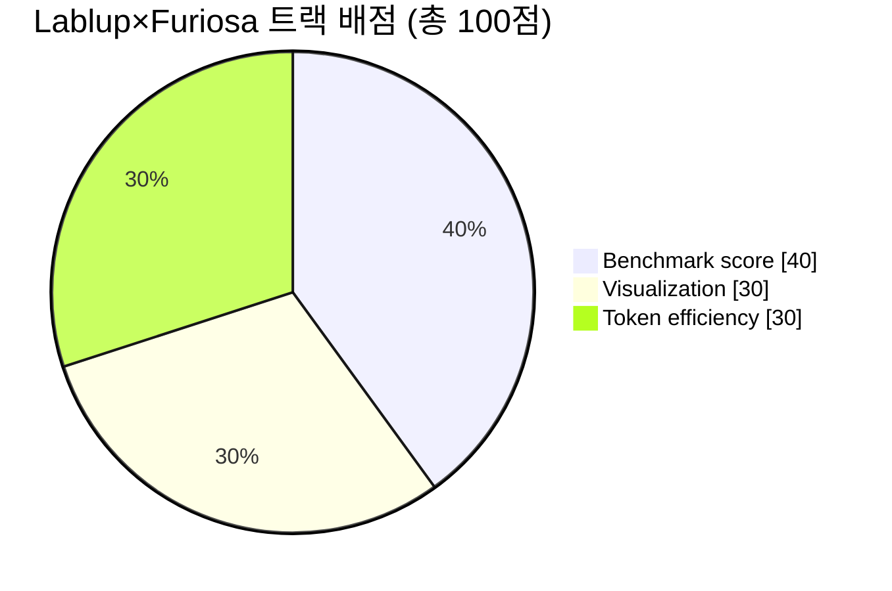
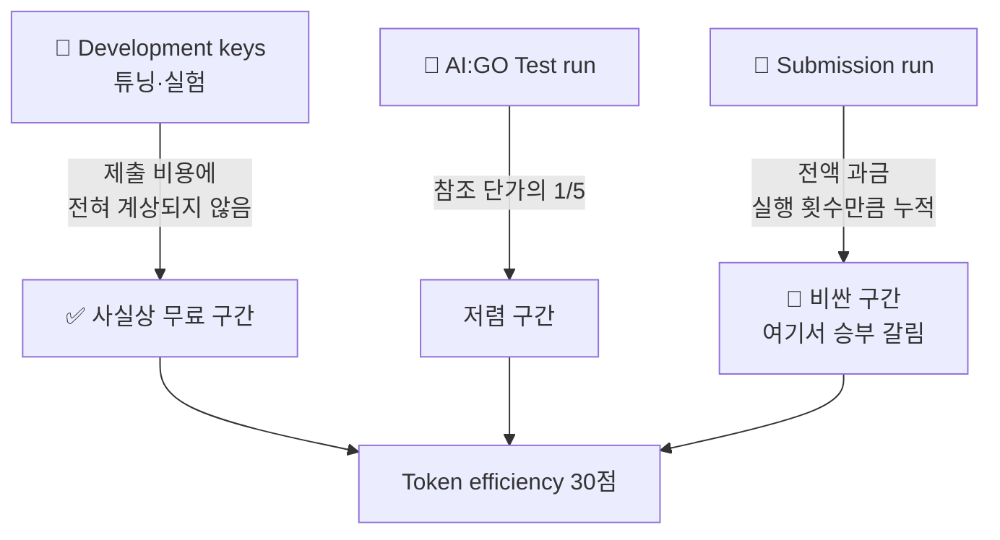
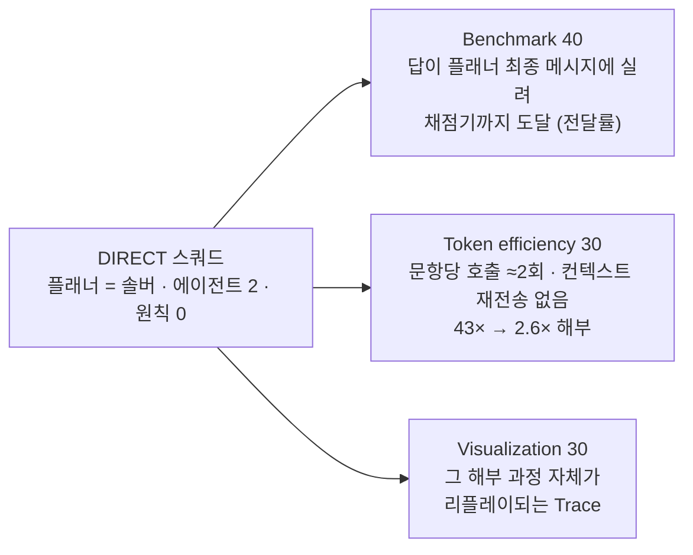

# 📊 채점 기준 상세 (공식)

> 출처: Lablup Track Challenge 공식 키노트 (2026.08.21), "Evaluation & Scoring" / "Token efficiency — Method and explanation". 제출 사이트·리더보드 실측으로 보강(2026-08-22/23).

## 배점

| 항목 | 배점 | 공식 설명 |
| --- | --- | --- |
| **Benchmark score** | **40** | 최종 벤치마크 테스트 결과에 따른 **팀 순위 순서대로** 점수 부여 |
| **Visualization** | **30** | 로그(텍스트) 데이터로 표현된 **Trace**를 얼마나 효과적으로 시각화했는가 |
| **Token efficiency** | **30** | 모델별 참조 단가(USD/Mtok) 기준 **총 정규화 사용 비용**이 낮을수록 고득점 |

> 📌 벤치마크는 절대 점수가 아니라 **순위 기반**입니다. 즉 1등과의 절대 격차보다 **몇 등인지**가 점수를 결정합니다.

> 📌 **리더보드 점수 vs 배점 3축**: 리더보드의 점수(0~1)는 **트랙 정확도의 가중 평균만**(coding .50 · math .25 · generic .25, 문항 38/13/96)이고 토큰은 동점 처리, 캡 없음("no wall-clock cap, no token cap") — 이것이 Benchmark 40의 순위를 정합니다. 토큰 비용은 별도 축(Token efficiency 30)으로 따로 채점됩니다. 채점은 전부 프로그램(테스트 통과 / 정답 일치 / 선택지 일치), 모델 심사 없음.

---

## 🎨 Visualization (30점) — 6개 평가 축

공식 문구에 시각화 평가 기준이 **6개 단어로 명시**되어 있습니다. 이 6개는 채점 루브릭 그 자체이므로, **각 단어에 대응하는 뷰를 하나씩 설계**하면 만점 구조가 됩니다. (우리 뷰어의 대응표는 [시각화·발표] 탭 §2)

| 평가 축 | 의미 | 대응 설계 |
| --- | --- | --- |
| **Observability** | 지금 무슨 일이 일어나는지 관측 가능한가 | 에이전트별 상태 배지 (thinking / running / verifying / idle) |
| **Interpretability** | 그 동작을 해석할 수 있는가 | 각 스텝의 입력→출력 요약을 사람이 읽을 수 있는 한 줄로 |
| **Traceability** | 결론까지의 경로를 되짚을 수 있는가 | 타임라인 + 스텝 클릭 시 해당 시점 전체 상태로 되감기, 로그 줄 링크 |
| **Explainability** | 왜 그렇게 했는지 설명되는가 | 결정마다 "왜 이 분기를 택했는가" 근거 표시 |
| **Clarity** | 한눈에 명료한가 | 노드 그래프 + 색상 일관성, 정보 과밀 금지 |
| **Insightfulness** | 새로운 통찰을 주는가 | 토큰·시간·정확도 상관관계, 실패 패턴 집계 등 **집계 뷰** |

> 💡 **Insightfulness가 승부처입니다.** 대부분의 팀은 "예쁜 실행 애니메이션"(Observability + Clarity)까지만 만듭니다. 여러 실행을 **누적 집계**해 "어디서 토큰이 낭비되는가" 같은 통찰을 보여주면 나머지 팀과 분리됩니다.

**입력 데이터는 "log(text) 형태의 Trace"** 입니다. 시각화 도구는 Trace 로그를 파싱해 렌더링하는 구조여야 하며, 실행과 시각화를 분리해두면 제출 후에도 리플레이 데모가 가능합니다.

---

## 💰 Token efficiency (30점) — 산식과 공략

### 공식 산식

- 모델별 **참조 단가(USD/Mtok)** 가 설정됨
- **총 정규화 사용 비용**으로 팀 순위를 매김 (낮을수록 고득점)
- **Test run(AI:GO 테스트 실행): 참조 단가의 1/5만 과금**
- **Submission run(제출 실행): 전액 과금**
- **모든 제출의 비용이 합산됨** — 평가 제출 포함
- 검증 제출(Validation)은 **실행 횟수만큼 전액 과금**: 1회 실행하면 1회, 100회 실행하면 100회 전부 과금
- 동일한 벤치마크 성능이라면 **토큰을 적게 쓴 팀이 더 높은 점수**

### ⭐ 결정적 힌트 — Prefix Cache

공식 제출 대시보드의 **Development usage** 화면:

> **Cached input**은 프롬프트 중 prefix 캐시에서 제공되는 부분입니다. 캐시된 입력은 새 입력보다 저렴하게 과금되므로, **변하는 부분 앞에 길고 안정적인 prefix를 두는 프롬프트 구조는 실질적인 여유를 벌어줍니다.**

실전 적용: 시스템 프롬프트·역할 설명은 **앞쪽에 고정**, 문제 본문(`{{TASK}}`)은 **맨 뒤** — 실측으로 캐시 적중 확인(86 토큰 중 68 적중). 대시보드의 **Cached share(%)** 지표가 곧 점수.

### 운영 전략

| 단계 | 사용할 것 | 이유 |
| --- | --- | --- |
| 스쿼드 설계·프롬프트 튜닝 | **Development keys** | 제출 비용에 계상되지 않음 → 마음껏 실험 (레이트리밋 60 rpm · 120K/40K tpm) |
| 파이프라인 동작 확인 | **Check(무료) + GUI 완주** | Check는 완전 무료이며 무제한 반복 가능 |
| 최종 검증 | Submission run 최소 횟수 | 전액 과금 + 횟수만큼 누적 |

> ⚠️ **가장 흔한 실패**: "일단 제출해보고 점수 보면서 고치자" — 제출 실행은 전액 과금되고 **모든 제출 비용이 합산**되므로 시행착오를 Submission으로 하면 토큰 효율 30점이 무너집니다. (우리 제출 이력과 비용은 [최종 제출] 탭 §4.)

### 제출 슬롯 제약

- 대기 제출: 키노트 표기 최대 3개 → **실계정 실측 1개** · 동시 실행 **1개** (팀당)
- 러너는 큐를 **배치 처리** — 결과 시점 예측 불가, 마감 직전 큐 정체 위험 → **최종 제출은 여유 있게**

---

## 채점 3축과 최종 설계의 대응

세 축은 한 이야기로 묶입니다 — **"관측할 수 있으면 줄일 수 있다"**: 보였기 때문에 줄였고(효율), 줄이는 과정이 곧 시각화 콘텐츠이며(시각화), 다시 관측해 "누구의 마지막 말이 채점되는가"를 찾아 전달률을 잡았다(벤치마크).
