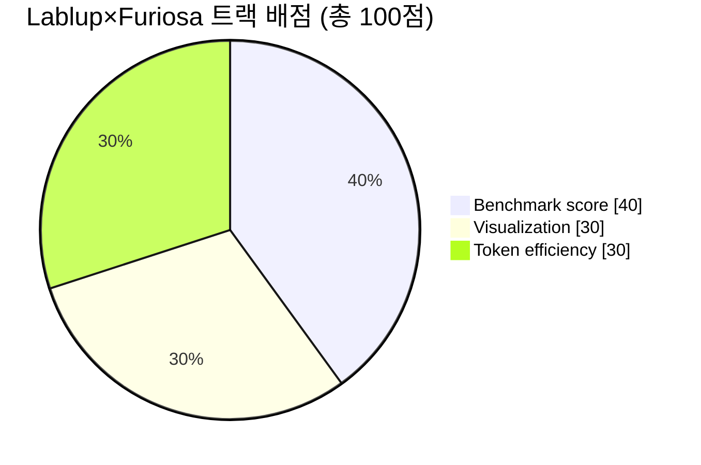
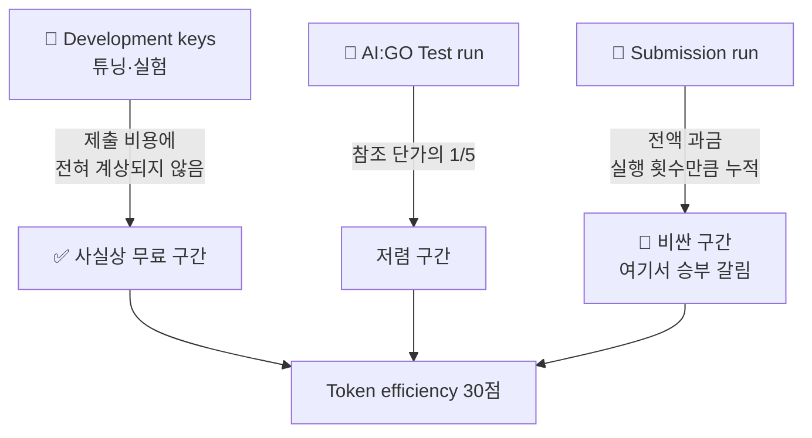
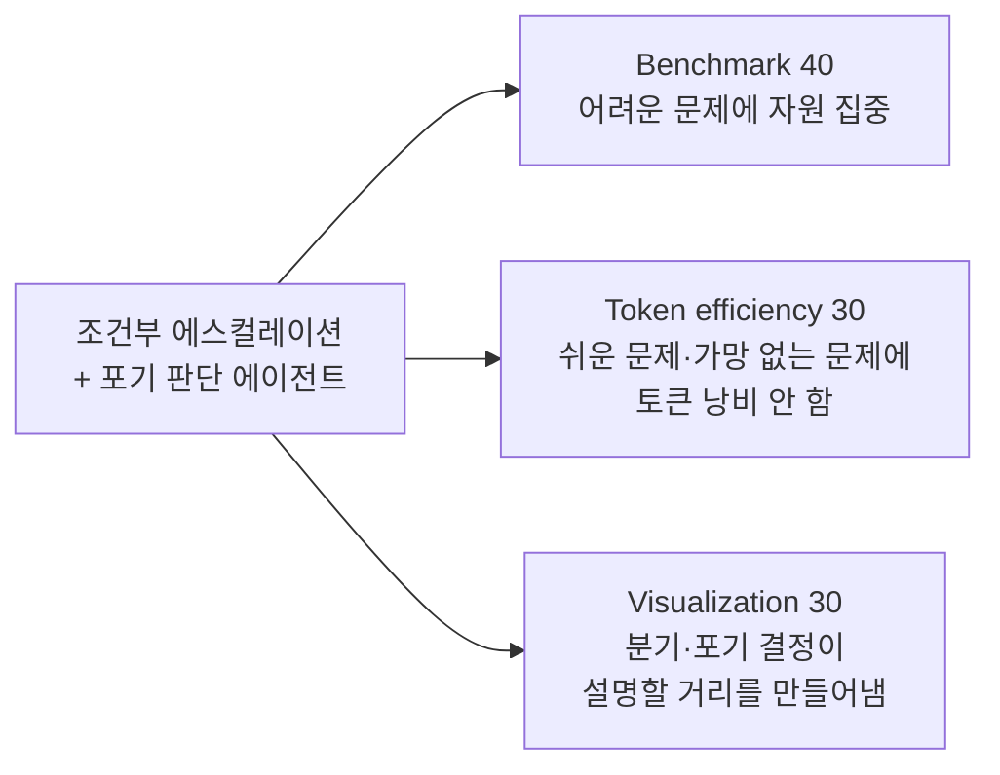

# 📊 채점 기준 상세 (공식)

> 출처: Lablup Track Challenge 공식 키노트 (2026.08.21), "Evaluation & Scoring" / "Token efficiency — Method and explanation"

## 배점

| 항목 | 배점 | 공식 설명 |
| --- | --- | --- |
| **Benchmark score** | **40** | 최종 벤치마크 테스트 결과에 따른 **팀 순위 순서대로** 점수 부여 |
| **Visualization** | **30** | 로그(텍스트) 데이터로 표현된 **Trace**를 얼마나 효과적으로 시각화했는가 |
| **Token efficiency** | **30** | 모델별 참조 단가(USD/Mtok) 기준 **총 정규화 사용 비용**이 낮을수록 고득점 |

> 📌 벤치마크는 절대 점수가 아니라 **순위 기반**입니다. 즉 1등과의 절대 격차보다 **몇 등인지**가 점수를 결정합니다.

---

## 🎨 Visualization (30점) — 6개 평가 축

공식 문구에 시각화 평가 기준이 **6개 단어로 명시**되어 있습니다. 이 6개는 채점 루브릭 그 자체이므로, **각 단어에 대응하는 뷰를 하나씩 설계**하면 만점 구조가 됩니다.

| 평가 축 | 의미 | 대응 설계 |
| --- | --- | --- |
| **Observability** | 지금 무슨 일이 일어나는지 관측 가능한가 | 에이전트별 실시간 상태 배지 (thinking / running code / verifying / idle) |
| **Interpretability** | 그 동작을 해석할 수 있는가 | 각 스텝의 입력→출력 요약을 사람이 읽을 수 있는 한 줄로 |
| **Traceability** | 결론까지의 경로를 되짚을 수 있는가 | 타임라인 + 스텝 클릭 시 해당 시점 전체 상태로 되감기 |
| **Explainability** | 왜 그렇게 했는지 설명되는가 | 라우팅/포기 결정마다 "왜 이 분기를 택했는가" 근거 표시 |
| **Clarity** | 한눈에 명료한가 | 노드 그래프 + 색상 일관성, 정보 과밀 금지 |
| **Insightfulness** | 새로운 통찰을 주는가 | 토큰·시간·정확도 상관관계, 실패 패턴 집계 등 **집계 뷰** |

> 💡 **Insightfulness가 승부처입니다.** 대부분의 팀은 "예쁜 실행 애니메이션"(Observability + Clarity)까지만 만듭니다. 여러 실행을 **누적 집계**해 "어떤 유형에서 어떤 에이전트가 토큰을 낭비하는가" 같은 통찰을 보여주면 나머지 팀과 분리됩니다.

**입력 데이터는 "log(text) 형태의 Trace"** 입니다. 따라서 시각화 도구는 Trace 로그를 파싱해 렌더링하는 구조여야 하며, 실행과 시각화를 분리해두면 제출 후에도 리플레이 데모가 가능합니다.

---

## 💰 Token efficiency (30점) — 산식과 공략

### 공식 산식

- 모델별 **참조 단가(USD/Mtok)** 가 설정됨
- **총 정규화 사용 비용**으로 팀 순위를 매김 (낮을수록 고득점)
- **Test run(AI:GO 테스트 실행): 참조 단가의 1/5만 과금**
- **Submission run(제출 실행): 전액 과금**
- **모든 제출의 비용이 합산됨** — 평가 제출 포함
- 검증 제출(Validation)은 **실행 횟수만큼 전액 과금**: 1회 실행하면 1회, 100회 실행하면 100회 전부 과금
- 동일한 벤치마크 성능이라면 **토큰을 적게 쓴 팀이 더 높은 점수**

### ⭐ 결정적 힌트 — Prefix Cache

공식 제출 대시보드의 **Development usage** 화면에 다음 설명이 적혀 있습니다:

> **Cached input**은 프롬프트 중 prefix 캐시에서 제공되는 부분입니다. 캐시된 입력은 새 입력보다 저렴하게 과금되므로, **변하는 부분 앞에 길고 안정적인 prefix를 두는 프롬프트 구조는 실질적인 여유를 벌어줍니다.**

이것은 주최측이 직접 알려준 **최적화 경로**입니다. 실전 적용:

- 시스템 프롬프트, 툴 정의, few-shot 예시, 스쿼드 역할 설명을 **전부 프롬프트 앞쪽에 고정 배치**
- 문제 본문·이전 시도 결과 등 **가변부는 반드시 맨 뒤**로
- 에이전트 간 메시지 전달 시 전체 히스토리 재전송 금지 → **고정 prefix + 델타만**
- 스쿼드 내 모든 에이전트가 **동일한 prefix를 공유**하도록 설계하면 캐시 적중률 극대화
- 대시보드의 **Cached share(%)** 지표를 보며 튜닝 — 이 수치를 올리는 것이 곧 점수

### 운영 전략

| 단계 | 사용할 것 | 이유 |
| --- | --- | --- |
| 스쿼드 설계·프롬프트 튜닝 | **Development keys** | 제출 비용에 계상되지 않음 → 마음껏 실험 |
| 파이프라인 동작 확인 | **Check(무료) + Test run(1/5)** | Check는 완전 무료이며 무제한 반복 가능 |
| 최종 검증 | Submission run 최소 횟수 | 전액 과금 + 횟수만큼 누적 |

> ⚠️ **가장 흔한 실패**: "일단 제출해보고 점수 보면서 고치자" — 제출 실행은 전액 과금되고 **모든 제출 비용이 합산**되므로, 시행착오를 Submission으로 하면 토큰 효율 30점이 무너집니다. 반드시 Development key와 무료 Check에서 수렴시킨 뒤 제출하세요.

### 제출 슬롯 제약

- 대기 제출 **최대 3개**
- 동시 실행 **1개** — 팀당 한 번에 하나의 평가만 실행되고, 대기 제출은 앞선 실행이 끝날 때까지 기다림
- 마감 직전에는 큐가 밀릴 수 있으므로 **최종 제출은 여유 있게**

---

## 채점 3축을 동시에 만족시키는 단일 설계

세 항목은 따로 노는 것이 아니라 **하나의 설계로 동시에 공략**할 수 있습니다.

라우팅과 포기 판단이 있는 스쿼드는 **토큰을 아끼면서(30점)**, 아낀 자원을 어려운 문제에 몰아 **정확도를 올리고(40점)**, 그 판단 과정 자체가 **시각화에서 설명할 콘텐츠(30점)** 가 됩니다. 세 축이 한 방향을 가리키므로 이 구조를 뼈대로 삼는 것이 가장 효율적입니다.
