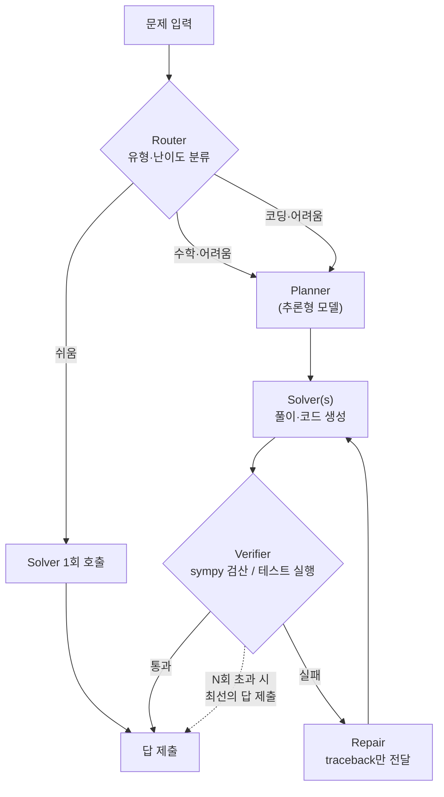
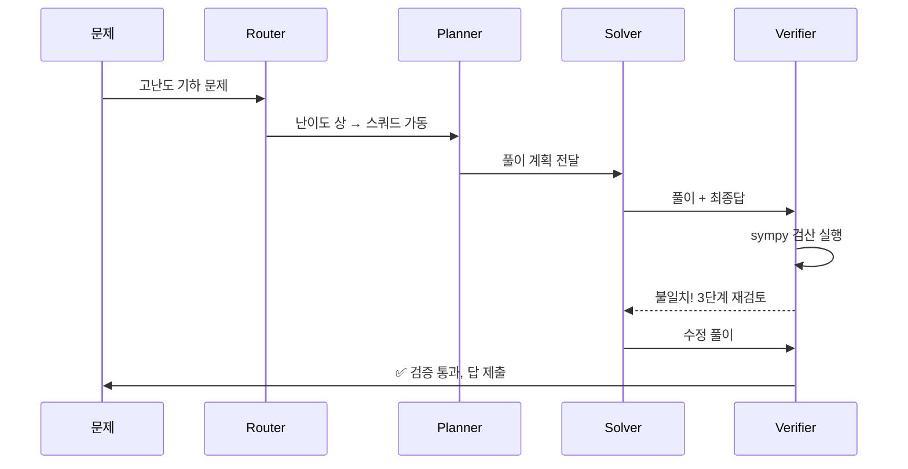

# 🏆 우승 전략

## 1. 아키텍처: 조건부 에스컬레이션 스쿼드

RNGD 위 소형 모델의 약점(단발 추론 정확도)을 구조로 보완하되, **토큰 효율 채점을 의식**한 설계:

- **수학**: Solver 풀이 → Verifier가 **코드 실행(sympy/수치 검산)**. LLM끼리 디베이트시키는 것보다 코드 검산이 토큰당 정확도 상승이 압도적.
- **코딩**: 코드 생성 → **테스트 실제 실행** → 실패 시 **traceback만 잘라서** Repair에 전달 (전체 히스토리 재전송 금지).
- **모델 3종 역할 배정**: 핸즈온에서 각 모델 성격(추론형/코딩형/일반형) 파악 후 에이전트별 적재적소 배치 — 발표자가 명시적으로 장려한 부분.

## 2. 토큰 효율을 "기능"으로

- 라우팅으로 쉬운 문제는 1-shot, 어려운 문제만 스쿼드 가동 → **문제당 토큰 예산을 시스템에 명시**.
- 대시보드에 **"문제별 사용 토큰 / 정답 여부"** 표시 → 채점 기준을 정면으로 겨냥.
- 킬러 문장: *"우리는 X% 정확도를 문제당 평균 Y 토큰으로 달성했다."*

## 3. 시각화 = 승부처 (참가자 투표 60%)

- 에이전트 노드 그래프가 **실시간으로** 빛나며 메시지가 흐르는 뷰 (WebSocket + force graph면 충분).
- 각 에이전트의 상태(생각 중/코드 실행 중/검증 중), 메시지 요약, 누적 토큰 게이지.
- **"어려운 문제가 들어오면 스쿼드가 살아나는 30초 시나리오"** 를 데모 엑스포용으로 반복 연습.

## 4. 사전 설계(agent-core) 활용 시 주의

- 툴 교체형 도메인 전환 설계 → 이 트랙에서는 `math_verify(sympy)`, `code_exec(샌드박스)`, `test_runner`로 툴셋 구성.
- 모델 어댑터는 AI:GO / Backend.AI 엔드포인트(OpenAI 호환 가능성 높음)로 연결.
- ⚠️ **"행사 전 작성 코드 금지"** — 설계만 참고하고 코드는 현장에서 새로 작성. 오픈소스는 명시하면 허용 → 재사용 기준은 "행사 전 공개된 오픈소스인가". 애매하면 부스에 확인.

## 5. 피치 스토리라인 (파트너 심사 40%)

1. **문제**: 고난도 추론에 거대 모델이 필요하다? GPU는 비싸고 전력을 먹는다.
2. **해법**: 국산 NPU(RNGD) 위 소형 모델들을 스쿼드로 조직 → 정확도와 효율을 동시에.
3. **증명**: 벤치마크 점수 + 토큰/전력 효율 수치 + 라이브 시각화.
4. **비전**: "Make AI Accessible" — 저전력 NPU 에이전트 스쿼드는 AI를 전기처럼 만드는 길.
   → **두 회사의 미션 문장을 피치에 그대로 인용**하면 트랙 파트너 심사위원에게 직접 꽂힙니다.

## 6. 실행 타임라인

| 시점 | 할 일 |
| --- | --- |
| 8/21 밤 | 킥오프 제안서 제출(24:00), AI:GO 설치, 엔드포인트 3종 성격 테스트 |
| 핸즈온 (9:00–9:30) | **전원 참석** — Squad 구성법, 제출 포맷, 채점 파이프라인 질문 |
| 8/22 오전 | Router + Solver + 코드실행 Verifier 최소 파이프라인 완성, 공개 벤치 자가 채점 |
| 8/22 오후 | 모델별 역할 최적화, 토큰 예산 튜닝, 시각화 대시보드 |
| 8/22 밤 | 미공개 문제 대비 범용성 테스트(문제 유형 랜덤 변형), 제출 리허설 |
| 8/23 오전 | 피치덱(영문 PDF)·요약·리포 정리, **12:00 제출** |
| 8/23 오후 | 데모 엑스포 30초 라이브 시나리오 반복 연습 |
