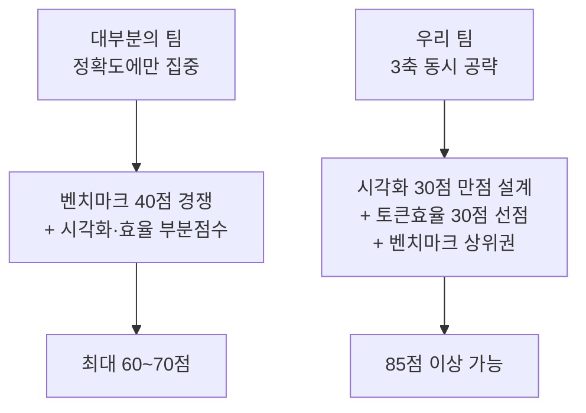
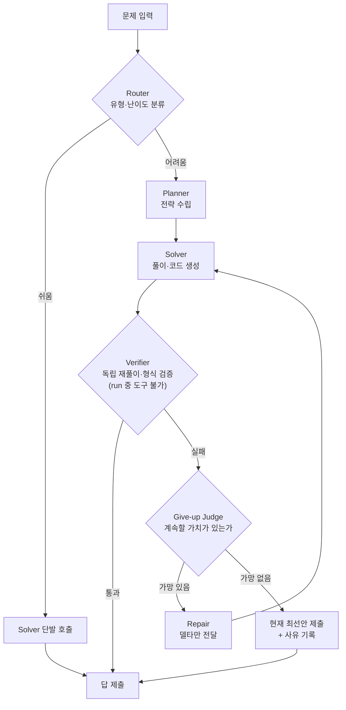

# 🏆 필승 전략

> ✅ 공식 키노트(2026.08.21) 확정 배점 **벤치마크 40 / 시각화 30 / 토큰효율 30** 기준으로 재작성한 전략입니다.

## 전략의 출발점

배점이 공개되면서 게임의 성격이 바뀌었습니다. **벤치마크는 40점뿐이고, 나머지 60점은 시각화와 토큰 효율**입니다. 정확도만 끌어올리는 팀은 최대 40점에서 멈춥니다. 반대로 시각화(30)와 토큰 효율(30)은 **엔지니어링 난이도가 낮으면서 배점이 크고, 경쟁 팀 대부분이 소홀히 할 영역**입니다.

---

## 0. 최우선 전략 — 트랙별 모델 배정 (실측 기반)

제출 시스템의 공개 데이터를 조회한 결과, **판을 뒤집는 사실 두 가지**를 확인했습니다. 자세한 근거는 [벤치마크 구성] 탭에 있습니다.

**① 히든 세트는 수학이 아니라 generic(MMLU-Pro)이 지배합니다.** generic 448~698문항, coding 140~240문항, math 60~66문항. 수학은 전체의 10%도 안 됩니다.

**② 평가 모델 3개 중 2개가 reasoning 모델이고, 그중 하나는 답을 내기 전 출력 예산의 97%를 사고 토큰에 씁니다.** 주최측이 공지에서 "토큰 상한이 reasoning 스쿼드에 약 10배 가혹하게 작용한다"고 경고했습니다.

이 둘을 곱하면 결론이 나옵니다. **문항이 가장 많은 generic에 reasoning 모델을 붙이면 토큰 상한에 걸려 무너집니다.**

| 트랙 | 배정 | 이유 |
| --- | --- | --- |
| generic (MMLU-Pro) | **instruct 모델** | 객관식. 장문 사고가 정확도를 못 올리면서 상한만 소모 |
| coding (LiveCodeBench) | instruct 중심 | 채점기가 테스트를 실행해 채점 — 스쿼드는 정확한 코드 생성에 집중 |
| coding (SWE-bench) | reasoning 선별 투입 | 저장소 맥락 파악 필요 |
| math (AIME/MATH-500) | **reasoning 모델** | 사고 토큰이 값어치를 하는 유일한 구간 |

> 대부분의 팀은 "고난도 수학 스쿼드"를 만들 것입니다. 문항 수 분포를 본 팀만이 generic에 자원을 배분합니다. **이것이 이번 트랙의 최대 정보 우위입니다.**

또한 **공개 연습 세트**(`/practice-sets/`)를 내려받아 자체 채점 루프를 붙이면, 제출 없이 **무료로** 성능을 측정할 수 있습니다. math는 `run_repeats: 2`로 2회 반복 채점되므로 재현성 없는 정답은 통하지 않습니다.

---

## 1. 아키텍처: 스페셜리스트 로스터 + 짧은 경로 + 포기 판단

> ⚠️ **정정(2026-08-22)**: 에이전트 수는 제약이 아님(≤50). 비용은 로스터 크기가 아니라 **문항당 홉 수**로 결정 — 호출 안 되는 스페셜리스트는 공짜. 트랙별 전담 에이전트 8~9개 + 문항당 2~3홉이 권장 구조. 상세 로스터는 [빌드 가이드] STEP 1.

아래 4역할 다이어그램은 **하나의 문항이 지나가는 논리 경로**로 읽을 것 (역할 분류이지 에이전트 개수 상한이 아님):

키노트가 스쿼드 역할을 **직접 열거**했습니다 — 읽는 에이전트, 수정하는 에이전트, 검증하는 에이전트, **포기 시점을 판단하는 에이전트**. 이 네 가지를 그대로 구현하는 것이 출제 의도에 정면으로 부합합니다.

**포기 판단 에이전트가 세 배점을 동시에 건드립니다.** 가망 없는 문제에서 루프를 끊어 **토큰을 아끼고(30점)**, 아낀 예산을 어려운 문제에 재배분해 **정확도를 올리며(40점)**, "왜 여기서 포기했는가"라는 판단 근거가 **시각화에서 설명할 콘텐츠(30점)** 가 됩니다.

**⚠️ 검증 방식 정정 (2026-08-22)**: practice-sets 공식 안내문에 *"your squad has no tools during a run"* 이 명시되어 있습니다. **평가 실행 중에는 코드 실행·검색 등 도구를 쓸 수 없습니다.** 따라서:

- **평가 시점 검증은 LLM 자체 능력으로**: Verifier 에이전트는 풀이를 독립 재계산(다른 경로로 다시 풀기), 단위·자릿수·경계값 점검, REQUIRED OUTPUT 형식 준수 확인 같은 **프롬프트 기반 검증**을 수행. 같은 문제를 다른 접근으로 한 번 더 풀어 답이 일치하는지 보는 **경로 이중화**가 토큰 대비 가장 효과적입니다.
- **코드 실행 검증(sympy·테스트 실행)은 개발 단계 전용**: 자체 채점 루프에서 프롬프트·라우팅 정책을 튜닝할 때 사용하고, 제출 스쿼드에는 포함하지 않습니다.
- LLM끼리 장문 토론을 시키는 방식은 여전히 금물 — 토큰 상한(reasoning 모델에 10배 가혹)에 정면으로 걸립니다.

---

## 2. 토큰 효율 30점 — 가장 확실한 득점 구간

### Prefix Cache 최적화 (주최측이 알려준 정답)

제출 대시보드가 **캐시된 입력은 저렴하게 과금되며, 변하는 부분 앞에 길고 안정적인 prefix를 두면 실질적 여유가 생긴다**고 명시했습니다. 이를 설계 원칙으로 삼습니다.

- 시스템 프롬프트·툴 정의·few-shot·역할 설명을 **전부 앞쪽에 고정**
- 문제 본문과 이전 시도 결과 등 가변부는 **반드시 맨 뒤**
- 스쿼드 전 에이전트가 **동일 prefix를 공유**하도록 통일 → 캐시 적중률 극대화
- Repair 단계에서 전체 히스토리 재전송 금지, **traceback 등 델타만** 전달
- 대시보드의 **Cached share(%)** 를 KPI로 두고 튜닝

### 과금 구조를 이용한 개발 루틴

| 단계 | 수단 | 비용 |
| --- | --- | --- |
| 프롬프트·스쿼드 튜닝 | Development keys | **제출에 계상 안 됨** |
| 파이프라인 점검 | Check | **완전 무료, 무제한** |
| 동작 검증 | AI:GO Test run | 참조 단가의 **1/5** |
| 최종 평가 | Submission run | **전액 + 횟수만큼 누적** |

> ⚠️ **절대 하지 말 것**: "제출해서 점수 보고 고치기". 모든 제출 비용이 합산되므로 시행착오를 제출로 하면 30점이 증발합니다. Development key와 무료 Check에서 수렴시킨 뒤 제출하세요. 제출 슬롯도 대기 3개·동시 실행 1개로 제한됩니다.

---

## 3. 시각화 30점 — 6개 축을 뷰 하나씩으로

공식 평가어 6개(observability, interpretability, traceability, explainability, clarity, insightfulness)에 **1:1로 대응하는 화면**을 만들면 채점자가 점수를 주지 않을 방법이 없습니다.

| 축 | 만들 것 |
| --- | --- |
| Observability | 에이전트 노드 그래프 + 실시간 상태 배지 |
| Interpretability | 스텝별 입력→출력 한 줄 요약 |
| Traceability | 타임라인 스크러버, 클릭 시 그 시점으로 되감기 |
| Explainability | 라우팅·포기 결정마다 근거 표시 |
| Clarity | 색상·레이아웃 일관성, 정보 과밀 배제 |
| **Insightfulness** | **여러 실행 누적 집계 뷰** ← 차별화 지점 |

**Insightfulness가 진짜 승부처입니다.** 대부분의 팀은 실행 애니메이션까지만 만들고 멈춥니다. 여러 실행을 누적해 "어떤 문제 유형에서 어떤 에이전트가 토큰을 낭비하는가", "포기 판단이 몇 토큰을 아꼈는가" 같은 집계를 보여주면 다른 팀과 완전히 분리됩니다.

입력은 **로그(텍스트) 형태의 Trace**이므로, 실행기와 시각화를 분리해 **로그 파일만 있으면 리플레이되는 구조**로 만드세요. 제출 이후에도 데모가 가능해지고, 데모 엑스포에서 네트워크 사고가 나도 안전합니다.

---

## 4. 피치 스토리라인

키노트의 출제 문장을 그대로 인용하며 시작하는 것이 가장 강력합니다.

1. **질문 인용** — "손에 쥘 수 있는 모델로 어디까지 갈 수 있는가?"
2. **우리의 답** — 거대 모델이 아니라 **구조**로 간다. 라우팅과 포기 판단이 있는 스쿼드.
3. **증명** — 벤치마크 순위 + Cached share·문제당 토큰 수치 + 누적 집계 시각화
4. **비전** — 저전력 NPU 위 소형 모델 스쿼드가 곧 **"Make AI Accessible"** 의 실현. Lablup의 미션 문장과 FuriosaAI의 전력 효율 서사를 그대로 잇는 마무리.

킬러 문장: **"우리는 X%의 정확도를 문제당 평균 Y 토큰으로 달성했고, 그 판단 과정 전부를 되감아 볼 수 있습니다."**

---

## 5. 실행 타임라인

| 시점 | 할 일 |
| --- | --- |
| **8/21 21:00–21:30** | Lablup 온보딩 — AI:GO 스쿼드 구성법 **전원 참석** |
| **8/21 21:30–22:00** | FuriosaAI 세션 — 전력·효율 서사 확보 (피치 재료) |
| 8/21 ~24:00 | 킥오프 제안서 제출, AI:GO 설치, 제출 사이트 계정·Development key 발급 |
| 8/22 새벽 | Router+Solver+Verifier 최소 파이프라인, Development key로 실험 |
| 8/22 오전 | 포기 판단 에이전트 추가, prefix 구조 확정 후 Cached share 측정 |
| 8/22 오후 | Trace 로그 스키마 확정 → 시각화 착수 (6개 축 체크리스트) |
| 8/22 밤 | 무료 Check로 수렴, Test run으로 검증, **1차 Submission** |
| 8/23 새벽 | 리더보드 확인 후 보정, Insightfulness 집계 뷰 완성 |
| 8/23 오전 | 피치덱·요약·리포 정리, 최종 Submission (큐 여유 확보), **12:00 제출** |
| 8/23 오후 | 데모 엑스포 — 로그 리플레이 기반 30초 시나리오 반복 |

---

## 6. 규정 리스크

- **행사 전 작성 코드 금지** — 사전 설계한 agent-core는 아키텍처만 참고하고 코드는 현장에서 새로 작성. 재사용 판단 기준은 "행사 전에 공개된 오픈소스인가"이며, 애매하면 트랙 부스에 직접 확인.
- **AI:GO agent squad 기능이 핵심 경로에 있어야 함** — 자체 오케스트레이터로 전부 대체하면 실격 소지. AI:GO Squad를 중심에 두고 시각화·검증 도구를 바깥에 붙이는 구조로.
- 오픈소스 라이브러리 사용 시 리포에 **명시 필수**.
