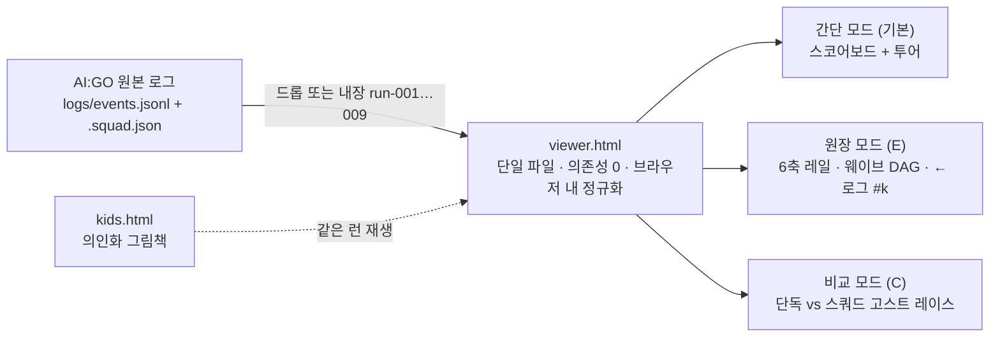

# 🎨 시각화 · 발표 — 현재 상태

🕒 **최신 반영: 2026-08-23 03:20 KST** · 설계 이력(The Bowl 컨셉, 후보 3안 심사, 뷰어 v1~v3.2)은 [📚 아카이브 › 시각화 전문].

## 0. 채점 대상은 "기록된 Trace의 인터랙티브 시각화"

공식 문언: **"로그(텍스트) 데이터로 표현된 Trace"** 를 observability · interpretability · traceability · explainability · clarity · insightfulness 관점에서 시각화. 실시간 스트리밍이 아니라 **리플레이**가 문언에 정확히 맞고, 데모 리스크가 0이다(네트워크·모델 지연·큐와 무관, 엑스포에서 무한 반복). 운영진 확인(8/22 18:36): 실행 로그 형식은 고정 → 뷰어는 AI:GO 원본 `logs/events.jsonl`(+`.squad.json`)을 드래그 앤 드롭으로 읽어 **브라우저 안에서 정규화**한다. 답 텍스트는 로그에 없다는 사실도 화면에 명시한다(정직한 Traceability).

## 1. 산출물 (공개 배포 완료)

| 산출물 | 위치 | 내용 |
| --- | --- | --- |
| **Trace Viewer v3.3** | https://jsonpassion.github.io/bibimbap/ → `viewer/viewer.html` | 데이터 기반 **웨이브 DAG 플로우** · 런 선택(run-001 v1 26,808 tok → … → run-008 '앙상블 실험(0.045)' → **run-009 v6.3 = LATEST**) · 토큰 3점 곡선(관측 → 절감 → 재투자) · 키노트 질문 띠 · **⚖ 채점 카드**(누구의 마지막 말이 채점되는가) · 딥링크 `#mode=&run=&t=` |
| 간단 모드 (기본 진입) | 〃 | 헤드라인 → 카드 3장(정확도 · 토큰 617 → 1,611 · 과정 6노드 플로우 + 이벤트 펄스) → "관측할 수 있으면 줄일 수 있다" · 용어 괄호 설명, 본문 16px+, 강조색 2~3개 · 안내 투어 5단계(`T` 재시작 · `D` 엑스포 자동 루프 · `E` 원장 모드) |
| 원장 모드 | 〃 | A 트랙별 정확도 표(n · CI90 · Δ) → B 히어로 617 → 1,611 + 트랙별 출력 토큰(572 → 450 · 740 → 385 · 2,036 → 1,489) + 누적 면적 → C 상호작용 스트립(상태 칩 + 한국어 캡션) · 에이전트 레인 · **원장(← 로그 #k · 체크섬 Σ)** · 판단 카드 · 각주("로그에 없는 것: 답 텍스트") · `H` 첫 스쿼드 v1 토글 |
| 비교 모드 `C` | 〃 | 단독 베이스라인(617 tok · 5.09s)과 스쿼드를 같은 시계 위에서 고스트 레이스, SPLIT 델타 칩 |
| **kids.html** | `viewer/kids.html` | 에이전트를 의인화한 그림책 + 실전 런 재생 |
| **피치덱** | `bibimbap/deck/deck.pdf` (12p) · `deck.html` | §3 |
| 리포 | https://github.com/jsonpassion/bibimbap (public, MIT) | viewer · kids · traces(공개 연습 세트 로컬 완주 로그만) · `normalize.py` · `analyze_run.py` · `test.js` · docs. 비밀키·히든 문항 없음(푸시 전 스캔) |

새 런 추가: 정규화 JSON을 `viewer.html`에 인라인 + `LATEST='run-00x'` 한 줄. 검증: `node test.js` 통과 + 실브라우저 콘솔 오류 0.

## 2. 루브릭 6축 ↔ 뷰어 요소 (심사 때 손가락으로 짚을 것)

| 축 | 뷰어 요소 |
| --- | --- |
| Observability | 웨이브 DAG 플로우 · 에이전트 레인(정의/가동) · 상태 칩(대기 / 사고 중 / 응답 / 검증 / give-up) |
| Interpretability | 스텝별 한국어 한 줄 캡션 · 판단 카드 |
| Traceability | 원장의 **← 로그 #k** 출처 링크 · 체크섬 `Σ = 로그 cum ✓` · 타임라인 스크러버 |
| Explainability | 판단 카드 · 비교표(원칙 0 · 라우팅 근거 · "'병렬' 웨이브 → 실제 직렬") · ⚖ 채점 카드 |
| Clarity | 간단 모드 기본 진입 · 16px+ · 강조색 2~3개 · 한 줄 요약 + 클릭 시 원문 |
| **Insightfulness** | 토큰 3점 곡선 26,808 → 1,611 → 12,544(실험) · 전수 측정 표 · 정직 각주("20문항 60%는 불운, 전수 79.1%") |

## 3. 피치덱 12장 (4분) — 타이밍·Q&A 숫자 출처는 `deck/speaker-notes.md`

1 타이틀 "관측할 수 있으면 줄일 수 있다" · 2 키노트 질문 & 우리 답(토큰이 보일 만큼 멀리) · 3 만든 것 3종(스쿼드 · Trace Viewer · 그림책) · 4 **43×의 순간**(26,808 vs 617) · 5 Trace가 보여준 3가지(플래너 중복 ×3 · 루프 공회전 28회 · 입력 재전송 91%) · 6 **÷17**(1,611) · 7 측정 문화(전수 표 + 써 보고 뺀 모델 Qwen3·EXAONE) · 8 리더보드 교훈(누구의 마지막 말이 채점되는가) · 9 **최종 DIRECT 스쿼드**(+ 앙상블 실험 0.045) · 10 시각화 6축 ↔ 뷰어 + 그림책 · 11 토큰 곡선(관측 → 절감 → 재투자 실험 → 단순화) · 12 클로징(메시지 · 리포/데모 URL · 팀)

**남은 편집**: 9장 `final-score-value`(리더보드 최종 점수) · 12장 `team-members`(팀원 이름) → `deck.pdf` 재생성. `summary.md`(1,196자) = 플랫폼 제출 폼 요약.

## 4. 발표 · 엑스포 운영

- **오프닝**: 키노트 질문을 그대로 인용 — "손에 쥘 수 있는 모델로 어디까지? — **토큰이 어디로 가는지 보일 만큼 멀리.**" **클로징**: 최종 점수 + "지능은 전기처럼 흐른다 — 저전력 한국산 NPU 위에서" + URL.
- **라이브 장면**: 비교 모드 `C`(단독 617 vs 첫 스쿼드 26,808 → v3.7b 1,611)와 ⚖ 채점 카드(앙상블 실험 0.045 → DIRECT) — 꾸밈이 아니라 기록이라는 점을 말한다.
- **데모 엑스포(13:00–16:00)**: 뷰어를 `D`(자동 루프)로 틀어두고 방문자에게 스크러버를 직접 만지게 한다 — 참가자 투표 60%를 움직이는 방법. 단일 파일 · 런 내장이라 네트워크 불필요.
