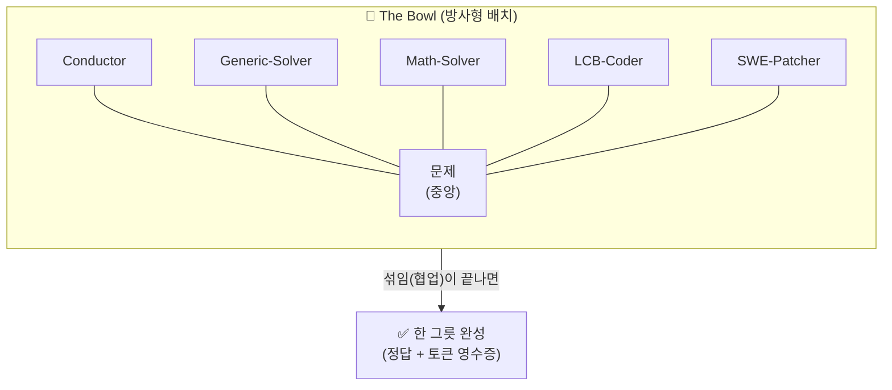
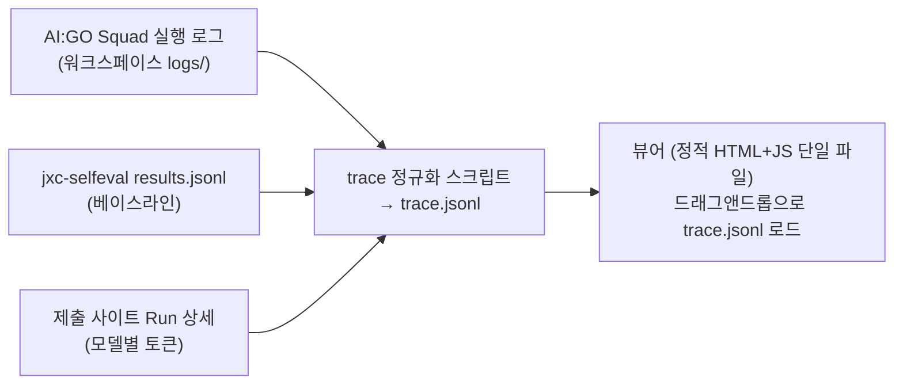

# 🎨 시각화 & 발표 설계 — Simple · Neat · Impressive

> 시각화 30점 + 참가자 투표 60%를 겨냥한 최종 산출물·발표 구상. (2026-08-22)

## 0. 먼저, "실제 추론 과정을 라이브로 보여줘야 하나?" — 아니오

공식 채점 문언: **"로그(텍스트) 데이터로 표현된 Trace를 얼마나 효과적으로 시각화했는가"** (observability · interpretability · traceability · explainability · clarity · insightfulness). 키노트 요구는 "스쿼드의 문제 해결 **과정**의 인터랙티브 시각화(웹, 애니메이션 제너레이터 등)".

즉 채점 대상은 **기록된 Trace의 인터랙티브 시각화**이지, 실시간 추론 스트리밍이 아닙니다. 오히려:

- **리플레이 방식이 정답에 더 가깝습니다** — Trace(로그)가 입력이라고 명시했으므로, 로그 파일만으로 완전 재생되는 뷰어가 문언에 정확히 부합
- 리플레이는 데모 리스크 제로 (네트워크·모델 지연·큐 대기와 무관, 데모 엑스포에서 무한 반복 가능)
- reasoning 전문(수천 토큰)을 그대로 노출하는 것은 **clarity 감점 요인** — 한 줄 요약 + 클릭 시 원문 펼치기가 6축 모두에 유리

## 1. 컨셉: "The Bowl" — 비빔밥이 곧 시각화 언어

프로젝트명(BIBIMBAP)과 시각화를 하나의 은유로 통일합니다. 설명이 필요 없는 그림 한 장:

- **그릇 중앙 = 현재 문항**, 둘레 = 에이전트(재료). 활성 에이전트가 빛나고, 메시지가 **재료가 섞이듯** 중앙으로 흐름
- 문항이 풀리면 그릇이 "완성"되고 다음 문항으로 — 벤치마크 진행 자체가 **비빔밥이 차례로 완성되는 스토리**
- 색 언어 고정: 대기=회색 · 사고 중=노랑 · 응답=파랑 · 검증 통과=초록 · give-up=주황 (Clarity)

## 2. 화면 3개 = 루브릭 6축 (이 이상 만들지 않는다)

| 화면 | 내용 | 커버하는 축 |
| --- | --- | --- |
| **① The Bowl** (리플레이) | 방사형 에이전트 그래프 + 상태 배지 + 하단 타임라인 스크러버(재생/배속/문항 점프) | Observability, Clarity, Traceability |
| **② Decision Lens** (스텝 상세) | 아무 스텝이나 클릭 → 라우팅 근거("왜 이 에이전트에게?"), 검증 판정, give-up 사유. 각 메시지는 **한 줄 요약, 클릭 시 원문** | Interpretability, Explainability |
| **③ The Receipt** (집계) | 트랙별 정확도×토큰, 캐시 적중률, give-up이 아낀 토큰, 홉 수 분포, 그리고 히어로 숫자 **"정답 1개당 평균 X 토큰"** | Insightfulness |

**Impressive 장치는 딱 하나만**: ①에서 **"Baseline vs BIBIMBAP" 나란히 재생 모드** — 같은 문항을 왼쪽(단일 모델)과 오른쪽(스쿼드)이 동시에 푸는 경주. 왼쪽은 토큰 게이지가 치솟고, 오른쪽은 1홉 만에 초록불. 30초 안에 프로젝트 전체가 설명됨. (베이스라인 데이터는 이미 확보되어 있어 구현 비용이 낮음)

## 3. 데이터 파이프라인

trace.jsonl 이벤트 스키마(최소): `{t, item_id, track, agent, event(start|message|verdict|giveup|final), summary, tokens_in, tokens_out, cached, detail}` — selfeval 출력이 이미 이 형태에 가까워 정규화 비용이 낮음.

## 4. 배포 방식

- **뷰어는 팀 프로젝트 리포에 포함** (제출물의 일부) — 빌드 없는 단일 `viewer.html`, 로그 파일 드래그앤드롭 + 샘플 trace 내장(오프라인 데모 안전)
- 프로젝트 리포의 GitHub Pages로 공개 → 제출 폼의 **Project Demo URL**로 사용
- 이 HQ 사이트와는 분리 유지 (팀 노트 ≠ 제품)

## 5. 발표 구성 (Final PT 4분, Simple·Neat·Impressive)

| 시간 | 장면 | 한 문장 |
| --- | --- | --- |
| 0:00–0:30 | 키노트 질문 인용 | "손에 쥘 수 있는 모델로 어디까지? — **한 그릇이면 충분합니다**" |
| 0:30–1:00 | The Bowl 정지 화면 1장 | "재료 하나하나는 한 끼가 못 되지만, 비비면 완성됩니다" (아키텍처 설명 끝) |
| 1:00–2:30 | **라이브 리플레이**: Baseline vs BIBIMBAP 경주 | 어려운 문항 하나 — 왼쪽 토큰 폭주, 오른쪽 1홉 완성 |
| 2:30–3:20 | The Receipt | "정답 1개당 평균 X 토큰. give-up이 아낀 토큰 Y. 캐시 적중 Z%" |
| 3:20–4:00 | 리더보드 + 비전 | "저전력 한국산 NPU 위에서, 지능은 전기처럼 흐릅니다 — Make AI Accessible" |

**데모 엑스포(13:00–16:00)**: 뷰어를 **자동 루프 모드**(문항 연속 리플레이)로 틀어두고, 방문자가 오면 스크러버를 직접 만지게 함 — "인터랙티브"를 심사위원 손으로 체험시키는 것이 참가자 투표 60%를 움직이는 방법.

## 6. 구현 우선순위 (시간 부족 시 자르는 순서)

1. The Bowl 리플레이 + 스크러버 (이것만 있어도 4축 커버) — **필수**
2. The Receipt 집계 (Insightfulness = 변별 축) — **필수**
3. Decision Lens 클릭 상세 — 강력 권장
4. Baseline vs 경주 모드 — 시간 남으면 (데이터는 준비됨)
5. 비빔밥 완성 애니메이션 등 장식 — 최후순위 (Simple 원칙: 장식이 정보를 이기면 감점)

---

## 7. 구현 현황 (8/22 오후) — 뷰어 v1 완성

- 위치: 프로젝트 리포 `bibimbap/viewer/viewer.html` (단일 파일, 의존성 0) + `normalize.py` + 테스트 절차 `docs/TESTING.md`
- **운영진 확인(18:36)**: "실행 로그 형식은 고정" — 키/값 커스터마이즈 불가. 뷰어가 AI:GO 원본 `events.jsonl`을 그대로 읽어 브라우저에서 정규화하는 설계가 정답이며, 평가 러너의 로그도 같은 형식이므로 **제출 런의 로그를 받으면 그대로 드롭해 리플레이 가능**.
- **데이터 소스 원칙**: 채점 대상은 "로그(텍스트) 데이터로 표현된 Trace" → **`logs/events.jsonl`(AI:GO 원본 로그)이 source of truth.** 뷰어는 이 파일을 `.squad.json`과 함께 **드래그 앤 드롭으로 직접 읽어 브라우저 안에서 정규화**한다. `trace.json`은 같은 규칙으로 만든 캐시/내보내기(베이스라인·캘리브레이션 부가 데이터 동봉용)일 뿐, 시각화의 근거는 항상 events.jsonl 한 줄 한 줄로 거슬러 올라간다(Traceability).
- 첫 리플레이 데이터: BIBIMBAP 1문항 완주(49 이벤트·3 태스크·28 호출·26,808 토큰) — "단독 모델 617 tok vs 스쿼드 26,808 tok = 43×" 비교 막대가 The Receipt에 이미 들어감
- 테스트 절차 T0~T5 (준비·Bowl·Lens·Receipt·원본 로그 적재·견고성) 는 `docs/TESTING.md` 참조

### 뷰어 v2 (8/22 저녁) — 최신 스쿼드(5종) 기준으로 갱신

- **기본 적재 = run-002 (v3.2 · 5 agents · 1,564 tok)**, 헤더의 런 선택으로 run-001 (v1 · 8 agents · 26,808 tok) 전환 → **Before/After 리플레이**가 클릭 한 번
- The Bowl: 5개 노드 + 모델명 표기(전원 gpt-oss-120b) + 중앙 홉 카운터("홉 2" = 플래너+전문가)
- Decision Lens 신규 행: **라우팅 근거**(요청 머리의 [PLANNING DIRECTIVE]가 지정한 담당 ↔ 실제 실행 에이전트 일치 ✅) · **원칙 0**(가동 2/5, 미가동도 로스터 읽기 비용 → 5종 고정) · 비용 판단("플래너 홉 + 전문가 1홉 + 취합 = AI:GO 최소 경로 도달 · v1 대비 ÷17")
- The Receipt: **3단 막대** 단독 617 → 스쿼드 v1 26,808 → 스쿼드 v3.2 1,564 + 해설("에이전트 호출 1회 = 컨텍스트 전체를 한 번 더 → 원칙 0")
- v3.4 스쿼드로 완주 로그가 생기면 run-003으로 정규화해 After를 교체(절차는 `docs/TESTING.md` T6)
