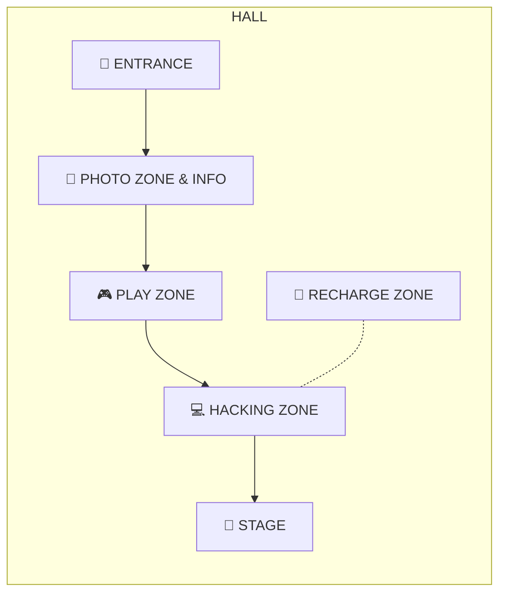

# 📍 현장 정보

## 🌐 Wi-Fi

| 항목 | 값 |
| --- | --- |
| SSID | `JunctionX Korea` |
| Password | `postech2026` |

## 📞 문의·긴급 연락처

**Offline**
- JUNCTION Booth 방문
- 근처의 JUNCTION Crew / Supporter에게 문의

**Online**
- Participant Discord — 질문은 `❓-question-and-answer` 채널
- 제출 확인은 `✅-confirm-submission` 채널
- 긴급: **+82-10-2687-9625 (Trisha Bak)**
- Instagram `@junctionasia` DM

## 🗺 장소 (HALL)

- 부스(①~⑧)는 홀 상·하단 벽면을 따라 배치, JUNCTION BOOTH / PHOTO BOOTH는 하단.
- 1F에는 좌우 양쪽에 부스 구역.
